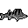

# Patreon/Supporter Benefits & Cosmetics

## **Minecraft Patron Benefits:**

* When you become a Patron supporter, you gain access to exclusive cosmetics that are yours to keep forever. Each month, we refresh the pool of bonus cosmetics available to active supporters. Here’s how it works:
  * 🔒 **Permanent Cosmetics:** Once you become a supporter, any cosmetics in the current pool for your support tier are permanently added to your account. These are yours to keep even if you decide to stop supporting in the future.
  * ✨ **Monthly Cosmetic Pool:** Every month, a new set of cosmetics is added to the pool. If you’re an active supporter during that month, you’ll receive these new items as part of your benefits. However, if you stop supporting, you won’t receive the new cosmetics from subsequent months.
  * 🗝️ **Treasure Chests:** Even if you’re no longer a supporter or if you missed out on certain cosmetics from a previous month, you can still obtain them by purchasing and unboxing Treasure Chests from the `/uc menu`. All cosmetics that have ever been in the pool remain available through this method.
  * 🔒 **Standard Cosmetics:** In addition to the monthly bonuses, there are standard cosmetics that are always available to supporters. These include exclusive pets, particle effects, mounts, and more, which you can access anytime as long as you’re a supporter.
  * ~~🎁 **Milestone Rewards:** Every 3 months of support earns you a special gift, increasing in value with your support tier—Kala, Fancy Kala, or Golden Kala. From unique titles to custom mounts, your dedication is rewarded at each milestone.~~  <mark style="color:red;">**W.I.P**</mark>

🎁Supporter Milestone Gifts: WORK IN PROGRESS!

As a token of our appreciation for your ongoing support, we’ve introduced a special milestone rewards program for all Patrons. The longer you support, the more exclusive and personalized the rewards become. Here's how it works:

**How It Works:**

* **Every 3 Months:** You’ll receive a unique gift that grows in value and rarity with each milestone you reach. These rewards are designed to enhance your gameplay experience and reflect your dedication to our community.
* **Tier-Based Rewards:** The gifts you receive are influenced by your supporter tier—Kala, Fancy Kala, or Golden Kala—with higher tiers unlocking even more exclusive rewards.

**Milestone Rewards:**

* **3 Months:**
  * **In-Game Title:** Unlock a custom title exclusive to your support tier.
  * **Cosmetics:** Receive rare cosmetics that are permanently added to your account.
* **6 Months:**
  * **Custom Emoticon:** Gain access to a unique emoticon to use in chat.
  * **Custom Pet:** Receive a personalized pet exclusive to your support tier.
* **9 Months:**
  * **Voting Power:** Gain additional voting power in server updates and balancing decisions.
  * **Personalized Armor/Weapon:** Collaborate with the team to design a unique piece of armor or weapon.
* **12 Months:**
  * **Custom Mount:** Unlock a special mount with unique traits, based on your support tier.
  * **1/1 Unique Item:** Receive a one-of-a-kind item, exclusive to you, with special abilities.
* **15 Months:**
  * **Personalized Feature:** Design a unique feature on the server, such as a custom room or event.
  * **Custom Emblem:** Create a personalized emblem or banner for your town or base.
* **18 Months:**
  * **Ever-lasting Monument:** Have a custom monument built in your honor, immortalizing your contributions.
  * **Cosmetic Set:** Unlock a full set of rare cosmetics exclusive to your tier.
* **21 Months:**
  * **Event Design:** Collaborate with the team to design a server-wide event or challenge.
  * **Advanced Mount:** Upgrade your mount with additional features, such as flying abilities or unique designs.
* **24 Months and Beyond:**
  * **World Feature:** Design a custom world feature, such as a hidden dungeon or special biome.
  * **Legacy Artifact:** Receive a powerful, symbolic item named after you, recorded in the server's history.

* **Retired Kala** 
  * No longer a supporter, but you keep all the cosmetics you earned before.
* **Kala** 
  * `/hat` _(block in hand will appear as an hat)_
  * Access to turn **Item Frames invisible** (`/itf toggle`)
  * `/nick`**:** Allows you to change your in-game name with a `~` prefix.
  * `/me`: Broadcast a narrative message about yourself in purple text for added style.
  * 🔒 Cosmetics:`/uc menu`
    * `15%` Discount on 🗝️Treasure Chests
    * **Pets:** Piggy, Cow
    * **Particle Effects:** Snow footprints
    * **Mounts:** Horse
* **Fancy-Kala** 
  * All benefits of Kala.
  * Rename items with `/itemname` and change item lore with `/itemlore`.
  * 🔒 Cosmetics:`/uc menu`
    * `20%` Discount on 🗝️Treasure Chests
    * **Pets:** Frog
    * **Particle Effects:** Sring footprints, Rain Cloud, Notes
    * **Mounts:** Donkey**,** Pig
*   **Golden-Kala** 

    * All benefits of Fancy-Kala.
    * 🔒  Cosmetics:`/uc menu`
      * `25%` Discount on 🗝️Treasure Chests
      * **Pets:** Allay
      * **Particle Effects:** Divine Halo, Ender Aura
      * **Mounts:** Ecologist Horse
    * ~~Access to decorative heads for decoration purposes (`/heads`)~~

    

    <figure><figcaption></figcaption></figure>

    

## Treasure Chests

Treasure Chests are a premium feature available for 500 euros. When purchased, four chests will appear around you in-game. Right-click to open them and discover a variety of rewards, including any of the cosmetics listed on our site. These rewards range from common to rare items, giving you a chance to obtain exclusive cosmetics. Additionally, you can win in-game money, with amounts ranging from 40 euros to 200 euros.

## List of all Cosmetics:

### Pets:

* **Common:** Piggy, Cow, Chick
* **Uncommon:** Bee, Frog
* **Rare:** Allay

### Particle Effects:

* **Common:** Snow Footprints,&#x20;
* **Uncommon:** Spring Footprints, Notes
* **Rare:** Ender Aura, Divine Halo

### Mounts:

* **Common**: Horse, Pig
* **Uncommon:** Donkey,
* **Rare:** Ecologist Horse,

### Hats:

[Link to Images](https://github.com/UltraCosmetics/UltraCosmetics/wiki/Hats)

* Emojis:
  * Scared, Angel, Embarrassed, Kissy, Sad, Cool, Surprised, Dead, Crying, Big Smile, WInk, Derp, Smile
* Blocks:
  * &#x20;Iron, Gold, Diamond, Piston, Command Block, Music, Bedrock
* Mobs:
  * Squid, Chicken, Pig, Blaze, Golem, Enderman
* Characters:
  * &#x20;Mario, Luigi, Batman, Skull, Ghost, Jack O' Lantern, Scary Clown, Santa, Present, Elf, All Colored Crewmates,&#x20;
* Edibles:
  * Bread, Cheese, Pancakes, Cake, Cookie, Candy Cane, Chocolate, White Chocolate, Apple, Melon, Carved Pumpkin, Strawberry, Coconut, Taco, Bacon, Fries, Hamburger, Popcorn, White Donut, Pink Donut, Chocolate Donut, Pie
* All letters in the English Alphabet

