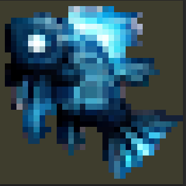

# Shadowfin

<table data-view="cards"><thead><tr><th></th><th></th><th></th></tr></thead><tbody><tr><td>Rarity: Legendary Tier: </td><td><strong>Stats:</strong> Chance: 50% Fish-health: 4 Experience: 280 XP Weight: 7 kg to 11 kg Price: €1.8 /kg  ~€15 Level:  </td><td><strong>Attribute:</strong> Swiftness</td></tr><tr><td></td><td></td><td></td></tr><tr><td>Generation:  Bloodline: N/A</td><td>
<strong>Ecology:</strong>  Biome: Snow Natural Factors:    * Rain: <mark style="color:green;">+10%</mark>

  *Time: Night <mark style="color:green;">+20%</mark>

  * Time: Day <mark style="color:red;">-25%</mark>

Baits: N/A 
</td><td></td></tr></tbody></table>

####

#### **Shadowfin** (Divine Tier)

𝑻𝒉𝒆 𝑺𝒉𝒂𝒅𝒐𝒘𝒇𝒊𝒏 𝒔𝒍𝒊𝒑𝒔 𝒕𝒉𝒓𝒐𝒖𝒈𝒉 𝒅𝒂𝒓𝒌, 𝒇𝒓𝒐𝒔𝒕𝒚 𝒘𝒂𝒕𝒆𝒓𝒔 𝒍𝒊𝒌𝒆 𝒂 𝒈𝒉𝒐𝒔𝒕.\
𝑰𝒕𝒔 𝒇𝒊𝒏𝒔 𝒂𝒓𝒆 𝒆𝒎𝒃𝒍𝒂𝒛𝒐𝒏𝒆𝒅 𝒘𝒊𝒕𝒉 𝒅𝒖𝒍𝒍, 𝒔𝒉𝒊𝒎𝒎𝒆𝒓𝒊𝒏𝒈 𝒔𝒊𝒍𝒗𝒆𝒓,\
𝒄𝒂𝒔𝒕𝒊𝒏𝒈 𝒔𝒉𝒂𝒅𝒐𝒘𝒔 𝒂𝒔 𝒊𝒕 𝒔𝒍𝒊𝒕𝒉𝒆𝒓𝒔 𝒕𝒉𝒓𝒐𝒖𝒈𝒉 𝒕𝒉𝒆 𝒊𝒄𝒆.\
𝑪𝒂𝒖𝒈𝒉𝒕 𝒐𝒏𝒍𝒚 𝒃𝒚 𝒕𝒉𝒐𝒔𝒆 𝒘𝒉𝒐 𝒅𝒂𝒓𝒆 𝒇𝒊𝒔𝒉 𝒅𝒆𝒆𝒑 𝒊𝒏 𝒇𝒓𝒐𝒛𝒆𝒏 𝒅𝒂𝒓𝒌𝒏𝒆𝒔𝒔,\
𝒕𝒉𝒆 𝑺𝒉𝒂𝒅𝒐𝒘𝒇𝒊𝒏 𝒔𝒆𝒆𝒎𝒔 𝒍𝒊𝒌𝒆 𝒊𝒕 𝒊𝒔 𝒎𝒐𝒓𝒆 𝒇𝒂𝒏𝒕𝒂𝒔𝒚 𝒕𝒉𝒂𝒏 𝒓𝒆𝒂𝒍.\
𝑨 𝒅𝒊𝒗𝒊𝒏𝒆 𝒄𝒂𝒕𝒄𝒉 𝒇𝒆𝒘 𝒂𝒏𝒈𝒍𝒆𝒓𝒔 𝒆𝒗𝒆𝒓 𝒄𝒍𝒂𝒊𝒎,\
𝒊𝒕 𝒄𝒂𝒓𝒓𝒊𝒆𝒔 𝒎𝒚𝒕𝒉𝒊𝒄 𝒔𝒆𝒄𝒓𝒆𝒕𝒔 𝒇𝒓𝒐𝒎 𝒘𝒊𝒕𝒉𝒊𝒏 𝒕𝒉𝒆 𝒊𝒄𝒆.

* **Attribute**: **Stealth/Vision**
  * This fish enhances stealth and vision, allowing for night vision or invisibility-related effects.
* **Special Ability Color**: **#6A0DAD** (Royal Purple)
