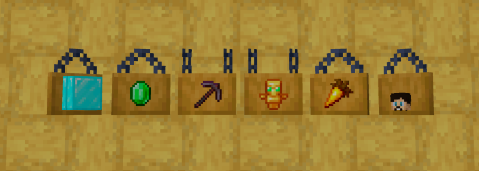

# 1.3.10

**Update** **New Features**

* Items on Hanging signs. _(Place an Item-frame first, then place the item you want to display)_
* **Sit** on stairs and slabs
* Craftable Horse Armor, Coral blocks and Gravel.

**Additional changes:**

* Fixed Bed-Respawn issue _(Thanks LordNovember64 for the report)_
* Updated to **1.20.4**
* Misc, configuration
  * decreased view-distance to 16
  * Increased player-idle-timout to 30 min
  * Enabled Town-Ruins, when instead of being deleted, they become ruined and anyone can re-claim the town, after 7 days it will be deleted unless anyone re-claims. Cost to reclaim=500e
  * Added PlayerAnalytics, tracking server performance and Playerbase. (Just for admins currently)
  * mob-spawn-range: 6
  * Lowered entity activation for animals and Monsters
  * merge items and exp range
  * Enabled replenish loottables
  * Enabled faster item despawning for Netherrack and cobblestone

<figure><figcaption></figcaption></figure>

 

<figure><figcaption></figcaption></figure>

 

<figure><figcaption></figcaption></figure>

 

<figure><figcaption></figcaption></figure>

