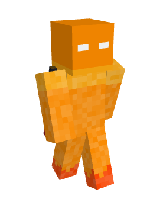

# 🎆 Launch day, September 8th

## **Launch Day Player Stories**

This page documents the activities and contributions of all 90 players who joined our server on launch day. Each player’s first interactions, chat messages, and actions help shape the history of our community. Explore the stories of our founding players!

***

### **Introduction**

On [September 8th, 2023](september-23.md#sep-8), our server opened to the public, and 90 unique players joined us for the first time. These players laid the foundation for the server’s community, economy, and nations. Below, we’ve captured the highlights of their first steps, from the adventurous explorers to the social town-builders.

***

### Founders - Launch Day Pioneers

Below is a complete list of players who joined the server on launch day. Click on any name to view their first actions and contributions.

#### **Player Index**

0_Koto_0

#### 

#### **Player: 0\_Koto\_0**

* **Joined**: \[17:35:16]

**Story:**

**0\_Koto\_0** quickly dove into the server’s economy right from the start. Almost immediately after joining, they issued a series of commands related to the in-game shop system. 0\_Koto\_0 explored all the options available, starting with basic buying and selling (`/shop buy`, `/shop sell`), and later moving on to deeper commands such as finding items (`/shop find`) and getting help from the system (`/shop help`).

Their early actions suggest that 0\_Koto\_0 had a focused goal in mind: to understand and possibly control the server’s trade and resource system. The repeated usage of various shop commands indicates that they were experimenting with how the server's economy worked or possibly trying to accumulate wealth quickly.

Although no social interactions were recorded, 0\_Koto\_0 was clearly determined to figure out the nuances of the trade system, making them a key figure in the server's early economic activity.

**Key Actions:**

* **Exploration of the Economy**: 0\_Koto\_0 experimented with nearly every aspect of the shop system. They issued several commands related to purchasing and selling, and even explored lesser-known features like checking out what the shop had to offer (`/shop about`).
* **Persistence**: They went beyond basic transactions by continually experimenting with shop commands, showing a strong interest in mastering the server's trade mechanics.

**Summary:**

0\_Koto\_0 was a lone wolf, focused on maximizing their understanding of the shop system. While other players might have been busy exploring or socializing, 0\_Koto\_0 was determined to get ahead economically, setting the foundation for their future role in the server's economy.

**Notable Commands:**

* `/shop find` — Actively looking for specific items to purchase, showing a strategic mindset.
* `/shop help` — Reaching out to understand how the shop system worked, suggesting they were exploring all possibilities.
* `/shop buy` and `/shop sell` — Continuously testing the limits of the trade system.

1_WK_1

.png>)

#### **Player: 1\_WK\_1**

* **Joined**: \[17:56:15]

**Story:**

**1\_WK\_1** was highly active and social during their time on the server. Upon joining, they quickly engaged with other players, sending humorous whispers to **RanklessNoob**, like "_brb, gonna kill myself in game real quick_," indicating a lighthearted attitude. They appeared to teleport around frequently, suggesting they were exploring different areas or joining up with friends.

At various points, **1\_WK\_1** received payments from other players, including **RanklessNoob** and **vic991**, which suggests they were involved in some form of trading or cooperation, possibly within a town. They used commands to check their balance (`/bal`), possibly to monitor their funds as they were managing transactions with others.

Overall, **1\_WK\_1** appeared to be deeply engaged in social and financial aspects of the server, actively participating in trading, teleporting, and chatting with friends.

**Key Interactions:**

* **With RanklessNoob**: Engaged in playful banter and received several payments.
* **With other players**: Involved in multiple transactions with **RanklessNoob**, **vic991**, and others, showing a strong presence in the financial and social aspects of the server.

**Notable Actions:**

* Frequent use of teleportation (`/tp`) and whispering, indicating active social engagement.
* Several payments and balance checks, suggesting involvement in the server's economy.

2019s

#### **Player: 2019s**

* **Joined**: \[19:16:24]

**Story:**

**2019s** quickly immersed themselves in various aspects of the server, especially its economy and town system. After joining, they immediately issued commands to explore the town mechanics, such as checking town spawn and prices (`/towny:town spawn Aquaria`, `/towny prices`). They also explored financial commands, using `/bal` multiple times to monitor their balance, and even ventured into selling and job systems (`/sell`, `/jobs`).

Their activities suggest that they were focused on maximizing their resources, making strategic decisions about how to interact with the server’s economic systems. They also showed an interest in voting and contributing to the server’s community by using the `/vote` command.

**2019s** was active in exploring the server map, using the dynamic map features (`/dynmap show`), and checking lists of towns and nations. Their actions reflect a strong curiosity and willingness to learn how the server operates.

**Key Actions:**

* **Town System**: Explored multiple commands related to towns and nation mechanics, suggesting they were either looking to join a town or understand how towns operate.
* **Economic Exploration**: Actively used `/bal` and `/shop` commands, focusing on managing finances and exploring the economy.

**Summary:**

**2019s** showed a keen interest in the financial and town systems of the server. Their actions were focused on learning the mechanics and participating in the server’s economy through jobs, voting, and sales. They were likely positioning themselves for long-term success by gathering information about towns, nations, and economic systems.

<strong>Adamski_1</strong>

#### **Player: Adamski\_1**

* **Joined**: \[17:29:57]

**Story:**

**Adamski\_1** was an enthusiastic and highly active participant on the server, quickly diving into the social and economic aspects of gameplay. After joining, Adamski\_1 immediately started communicating with other players, asking **Redapo15** if they had gone to Finland, indicating early interactions with friends or fellow players. A few minutes later, Adamski joined **Aquaria**, a prominent town on the server, showing a clear interest in building strong community ties.

**Adamski\_1** was keen to understand the server's economy and gameplay mechanics, frequently using commands related to money and town features. At one point, they asked the question, "_how do we earn money?_" in town chat, showcasing a strong curiosity about in-game finances.

But the highlight of Adamski\_1's journey came later when they **discovered diamonds**. Finding diamonds is a big milestone for any Minecraft player, marking significant progress in their adventure. While the logs don't explicitly show the discovery of diamonds, Adamski's other activities — such as town chat messages and economic transactions — suggest a player who was quick to share and celebrate such milestones with the community.

**Key Interactions:**

* **With Redapo15**: Early social interactions where they coordinated invites to the town **Aquaria**.
* **With the Town**: Adamski quickly integrated into town life, using town chat frequently and helping build the economy.
* **Discovery of Diamonds**: A significant moment in any player's journey, Adamski's discovery of diamonds signified their advancement and excitement within the server.

**Notable Actions:**

* **Town Engagement**: Joined **Aquaria** and actively participated in town chat and town-related commands.
* **Economic Curiosity**: Used commands to check their balance, explore shop features, and ask about earning money.

**Summary:**

**Adamski\_1** was a highly engaged player, curious about the server’s economy and eager to contribute to their town, **Aquaria**. Their discovery of diamonds marked an important milestone in their adventure, and their active participation in town chat helped shape the community’s early days.

Aytte

#### **Player: Aytte**

* **Joined**: \[17:30:13]

**Story:**

Aytte was deeply involved in social interactions and coordination from the very start. Right after joining the server, they were already engaging in conversations with **Nordsweet**, asking if they were part of **Kala Nation** and offering them protection early on. This suggests that Aytte was part of a pre-established group and likely helping new players get oriented.

Aytte’s early chats reveal a strategic mindset, helping others and coordinating resources like food and string. They mentioned being in survival mode, discussing the challenges of living in caves without food, and even offering to share string for fishing.

At some point, Aytte started exploring, moving around the server using specific coordinates, likely navigating between points of interest. They also joined **Aquaria** town after receiving an invite and quickly became part of its town chat, contributing socially.

Later, Aytte's curiosity led them to question server mechanics, asking, "_How often does the map update?_" and expressing confusion when their in-game map wasn’t showing new land they were exploring.

**Key Interactions:**

* **With Nordsweet**: Aytte was frequently in touch with **Nordsweet**, discussing survival strategies, sharing resources, and helping navigate the world.
* **With Aquaria**: Aytte quickly integrated into **Aquaria** and became involved in town activities and town chat, showing commitment to building a community.

**Notable Quotes:**

* "_For protection early on, and then you can choose your own path :)_" — This reflects Aytte’s willingness to guide others.
* "_Let me know if you find any string, I would like to fish._" — Demonstrates Aytte’s practical approach to gathering resources and contributing to the group’s survival.

BOBB0

.png>)

#### **Player: BOBB0**

* **Joined**: \[17:41:40]

**Story:**

**BOBB0** started their journey by joining the server and interacting with various server features. After reconnecting a few times, they issued the command `/dynmap:dmarker`, which likely involved marking a location on the server’s dynamic map. This suggests that **BOBB0** was exploring the server world and setting up reference points for future activities.

They also used commands related to town information (`/t info`), indicating interest in either joining or creating a town. Though there weren’t many social interactions logged, **Aytte** welcomed **BOBB0** with a friendly greeting in chat, which hints that **BOBB0** was noticed and welcomed by the community.

**Key Actions:**

* Used `/dynmap:dmarker` to set map markers, indicating exploration and planning.
* Checked town information with `/t info`, showing interest in server towns.

**Summary:**

**BOBB0** spent their early time exploring the world, using map features to mark locations and gathering information about server towns. Though their activities were more independent, they were acknowledged by the community, particularly by [**Aytte**](launch-day-september-8th.md#aytte), who greeted them warmly in chat.

BennyL4V4

#### **Player: BennyL4V4**

* **Joined**: \[19:10:28]

**Story:**

**BennyL4V4** had a focused approach upon joining the server. Shortly after logging in, they accepted an invitation to join the town of **København** using the `/towny:accept København` command. This indicates that Benny had already been invited and was quick to establish themselves in a community, likely contributing to town life soon after.

Their time on the server during this session was brief, and after joining [**København**](../the-world/towns/archived-towns/copenhagen.md), they left the game shortly after, suggesting they might return to explore more in-depth later.

**Key Actions:**

* Quickly joined the town [**København**](../the-world/towns/archived-towns/copenhagen.md).
* Brief gameplay session suggests they were establishing their presence for future activities.

**Summary:**

**BennyL4V4** had a brief but meaningful start, quickly integrating into the town of [**København**](../the-world/towns/archived-towns/copenhagen.md). Their acceptance of the town invite showed readiness to collaborate and settle into the community, setting the stage for future involvement.

* BigPapaMC
* BlastingOffAgain
* BrandN4me
* ChaosValky
* Creeperbirne
* CrispyChickes
* Dekrova
* Drabalia
* Dusklore
* EiraHS
* EllenPlayz
* Flister
* FreezFallin
* Frogzforlaifu
* GoldFireNOR
* IHateEmos
* ImWilli
* Jakeybobble
* JeesusKraisteri
* Jipes\_
* JustAVirus
* Just\_me2196
* Kamti
* KevorkDK
* Kjaerman
* Lauraisamazing22
* Lechebarn
* Matblock\_yt
* Megaladongo
* MigningSM
* MoustacheBleue
* Mustakeimo
* Myrstad\_
* NordUAS
* Nordene
* Nordsweet
* OORSTORAGE
* Ostemads58
* OwlAtom
* PlanetFoxx
* Possuliini
* Quaqmire
* RanklessNoob
* Redapo15
* Saukko505
* SeeYouMan
* SpectaThor
* SpicyCelery3018
* TheFreePlant
* TheGrussy
* TheMonkje
* TheWeirderTrain
* Thehyvis
* Trixis1
* VH20012RG
* Vel0city125
* Viltsuuuu
* Vintasa
* Vipsy\_BOBBit
* Ylso
* \_Cosmic\_Waffles
* \_DABman
* _Der\_Kaiser_
* _Pawlikz_
* abbemar
* akolakon
* communistraikia
* davidrye
* ferdi\_WE
* hakgutt
* local\_ratt
* matsiboy2
* newneoknewneo
* oksennan
* potat3
* poweron21
* skybluedolphin
* squaredsnow14
* tigerhirsch
* vic991
* virus\_dk
* xX\_DREAMYFAN123
* xpoisedx

### **The First Players to Discover Diamonds**

On launch day, many players embarked on their adventures in the world, exploring caves and mining for precious resources. The **\[Diamonds!]** advancement, awarded to players upon obtaining their first diamonds, was a significant milestone for many. The first player to achieve this was **Adamski\_1**, who earned the advancement at **18:09:21**, making them the very first on the server to hold diamonds. Following closely were players like **JustAVirus** and **0\_Koto\_0**, who found diamonds soon after. Here's a list of the first players to earn the **\[Diamonds!]** advancement:

1. **Adamski\_1** – 18:09:21 (First to hold diamonds)
2. **JustAVirus** – 18:21:55
3. **0\_Koto\_0** – 18:29:43
4. **JeesusKraisteri** – 18:36:42
5. **ferdi\_WE** – 18:49:53
6. **Quaqmire** – 18:54:02
7. **Jipes\_** – 19:03:05
8. **Viltsuuuu** – 19:05:47
9. _**Pawlikz**_ – 19:14:18
10. **NordUAS** – 20:10:04
11. **Drabalia** – 20:52:35
12. **Vintasa** – 20:52:57
13. **OwlAtom** – 20:54:37
14. **communistraikia** – 20:59:42
15. **\_Cosmic\_Waffles** – 20:59:57
16. **Saukko505** – 21:01:12
17. **tigerhirsch** – 21:02:46
18. **Nordene** – 21:25:05
19. **vic991** – 21:29:24
20. **SpicyCelery3018** – 21:30:27

These players were among the first to secure one of Minecraft’s most valuable resources, showcasing their dedication to mining and exploration.
