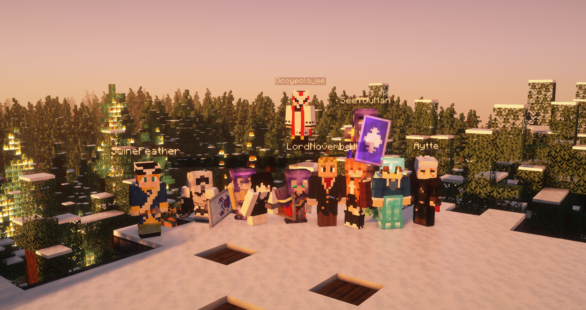

# 🔥 The Sápmi forest fire

Much of the destruction can be seen on the server map found here: [http://map.nordics.world/](http://map.nordics.world/) or here: [http://nordics.world:3200/](http://nordics.world:3200/)

## The fire

At approximately midday on August 8, 2024, [FiskerGuten](../../the-world/civilization/players/fiskerguten.md) alerted the server to a forest fire at the newly established [Helsinki](../../the-world/civilization/towns/helsinki.md) outpost in northern Sápmi. It is widely believed that the fire was caused by a recent thunderstorm. The majority of the burning forest was located in the taiga biome, which spans most of northern Sweden, and Finland. Given the memories of the [Northstar forest fire](northstar-forest-fire.md) and its lasting damage, it was obvious to the players that the fire would not extinguish on its own.

[Aytte](../../the-world/civilization/players/aytte.md) called for a group effort to combat the growing fire. On the same evening, an announcement was made in the discord for volunteers, and [Aytte](../../the-world/civilization/players/aytte.md), [Occypolojee](../../the-world/civilization/players/occypolojee.md), [FiskerGuten](../../the-world/civilization/players/fiskerguten.md), and [Bamson](../../the-world/civilization/players/\_bamson.md) promptly answered the call. With the initial interest in fighting the fire and the knowledge gained from the [Northstar forest fire](northstar-forest-fire.md), it seemed that the challenge might be possible. As a reward was promised to the players who helped with the fire, interest quickly grew, and at the start of the firefighting, the player count had grown to [8 firefighters](#user-content-fn-1)[^1].

Thanks to quick thinking by [Kesko Corporation](../../the-world/civilization/nations/kesko-corporation.md) leadership, a section of the burning forest was contained using claimed chunks, preventing the fire from spreading. This strategic move later proved crucial in redirecting efforts to prevent the fire from regaining a foothold in that area. The firefighting team prioritized the north and northwest parts of the fire, as the taiga forest in those areas was where the fire spread the fastest. Although these parts of the forest posed a challenge, the team used knowledge from the [Northstar forest fire](northstar-forest-fire.md) and successfully extinguished the fire. By this time, the firefighting team had grown to [11 firefighters](#user-content-fn-2)[^2].

As the north and northwest parts of the fire had been contained, the firefighters were now able to focus on extinguishing the south and eastern parts of the fire. Thanks to [Jipes](../../the-world/civilization/players/jipes.md) work in the eastern parts of the forest and because the forest wasn't as dense as the taiga, the fire had not managed to take hold. This led to a more controlled fire situation, and the fire was finally put out during the late evening of August 8.

The Firefighters

* 1\_WK\_1
* [CrispyChickes](../../the-world/civilization/players/crispychickes.md)
* [FiskerGuten](../../the-world/civilization/players/fiskerguten.md)
* [Jipes](../../the-world/civilization/players/jipes.md)
* [LordNovember](../../the-world/civilization/players/lordnovember.md)
* [NL\_Kommiedant](../../the-world/civilization/players/nl\_kommiedant.md)
* [SeeYouMan](../../the-world/civilization/players/seeyouman.md)
* Triirii
* [Aytte](../../the-world/civilization/players/aytte.md)
* [MingningSM](../../the-world/civilization/players/migningsm.md)
* [Occypolojee](../../the-world/civilization/players/occypolojee.md)
* [Bamson](../../the-world/civilization/players/\_bamson.md)

A special thanks to Confsuin for the moral support.


A text about the medal ceremony should be added


<figure><figcaption>
Group photo after the fire had been quenched
</figcaption></figure>

[^1]: The firefighters being:

    1\_WK\_1, FiskerGuten, Jipes, LordNovember, NL\_Kommiedant, Aytte, Occypolojee, Bamson

[^2]: The firefighters being:

    1\_WK\_1, CrispyChickes, FiskerGuten, Jipes, LordNovember, NL\_Kommiedant, SeeYouMan, Triirii, Aytte, MingningSM, Occypolojee, Bamson
