# Kala

<table data-view="cards" data-full-width="false"><thead><tr><th></th><th></th><th></th><th></th><th data-card-cover data-type="files"></th><th data-hidden data-type="checkbox"></th><th data-hidden data-type="files"></th><th data-hidden data-card-target data-type="content-ref"></th></tr></thead><tbody><tr><td></td><td>Leaders: <a href="../../players/redapo15.md">Redapo15</a>, <a href="../../players/jipes.md">Jipes</a></td><td>Capital: <a href="../../towns/finland-region/aquaria.md">Aquaria</a></td><td>Previous Towns: <a href="../../towns/finland-region/province-of-garvia/garvia/">Garvia</a>, <a href="../../towns/finland-region/muurmanni.md">Muurmanni</a>, <a href="../../towns/finland-region/north-karelia.md">North Karelia</a>, <a href="../../towns/other-regions/aquashore.md">Aquashore</a>, <a href="../../towns/finland-region/blobbenheim.md">Blobbenheim</a>,</td><td></td><td>true</td><td></td><td></td></tr><tr><td></td><td>Flag of Kala</td><td></td><td></td><td></td><td>false</td><td></td><td></td></tr><tr><td>Region: <a href="../../towns/finland-region/">Finland</a></td><td>Population at peak: 60</td><td>Founded:</td><td></td><td></td><td>false</td><td></td><td><a href="broken-reference/">broken-reference</a></td></tr></tbody></table>

***

### History

Kala was a nation that rose to glory and fell to ruin in the Nordics Minecraft server. It was founded by Redapo, a visionary leader with a grand plan for his nation. He chose Finland as his territory and quickly recruited many players to join him. He named his nation Kala and declared himself the emperor of the Kala Empire.

Kala was a militaristic nation that sought to dominate the server. It waged wars against other towns and nations and expanded its borders by force. It was involved in the North Karelian War, which erupted when North Karelia seceded from Kala due to high taxes. <_Kala also committed the Oulu Massacre, a brutal attack that killed all the players in the town of Oulo (More details needed)>_ Kala's enemies feared and hated its aggression and cruelty.

Aquaria was the capital and the largest town of Kala and the seat of Redapo's power. Aquaria had a big tunnel system connecting most buildings in the town and a big nether highway system built when The Nether was released. It also had a dome building that housed an enchantment bookshop, a courthouse used for meetings, and a harbor popular for fishing. It was a hub of trade and attracted many visitors. Aquaria was also the home of Jipes, the co-leader of Kala and Redapo's loyal friend.

Kala had three other towns: Muurmani, North Karelia, and Garvia. Muurmani was a town in the far north, near the Arctic Circle. It was a cold and isolated place, but also a strategic outpost for Kala's northern expansion. North Karelia was a town in the southwest. It was a prosperous but rebellious town that eventually broke away from Kala. Garvia was a town in the southeast, near the Gulf of Finland. It was a peaceful and friendly town.

Kala's downfall began when it lost its builders and its players. Kala had focused too much on war and conquest and neglected its infrastructure and development. Its towns became dilapidated and deserted. Kala also suffered from internal strife and external threats. Its people became unhappy and unfulfilled, and its enemies became stronger and bolder. Kala's glory faded, and its power waned.

Kala eventually became the weakest nation on the server and a shadow of its former self. It was abandoned by their players and reduced to a single town, Aquaria. It became an independent town and a relic of the past. It still bears the name of Kala, but it no longer claims to be an empire. It is a peaceful and friendly town but also a lonely and forgotten one. It is a town that once belonged to a nation that once ruled the Nordics Minecraft server but is now a ghost town.

***

### North Karelian War

<figure>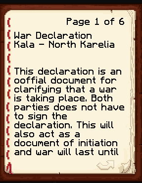<figcaption></figcaption></figure>

 

<figure><figcaption></figcaption></figure>

 

<figure>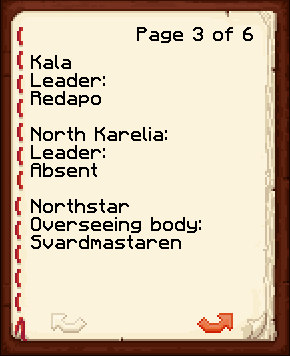<figcaption></figcaption></figure>

<figure>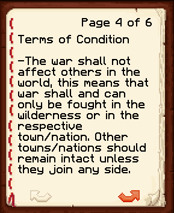<figcaption></figcaption></figure>

 

<figure>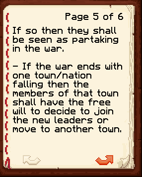<figcaption></figcaption></figure>

 

<figure>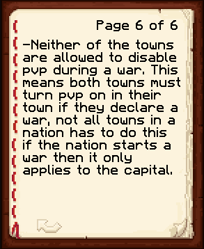<figcaption></figcaption></figure>

### Siege of Alesia

### North Karelian Peace Treaty

### Northstar Treaty

<figure>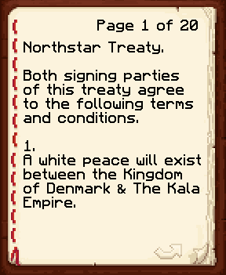<figcaption></figcaption></figure>

 

<figure>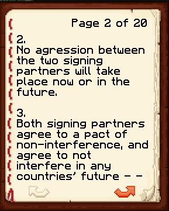<figcaption></figcaption></figure>

 

<figure>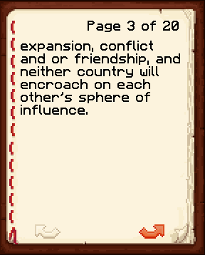<figcaption></figcaption></figure>

<figure>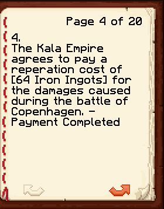<figcaption></figcaption></figure>

 

<figure>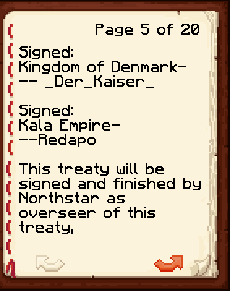<figcaption></figcaption></figure>

 

<figure>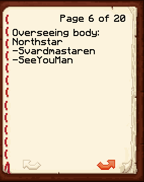<figcaption></figcaption></figure>

### Oulo Incident
