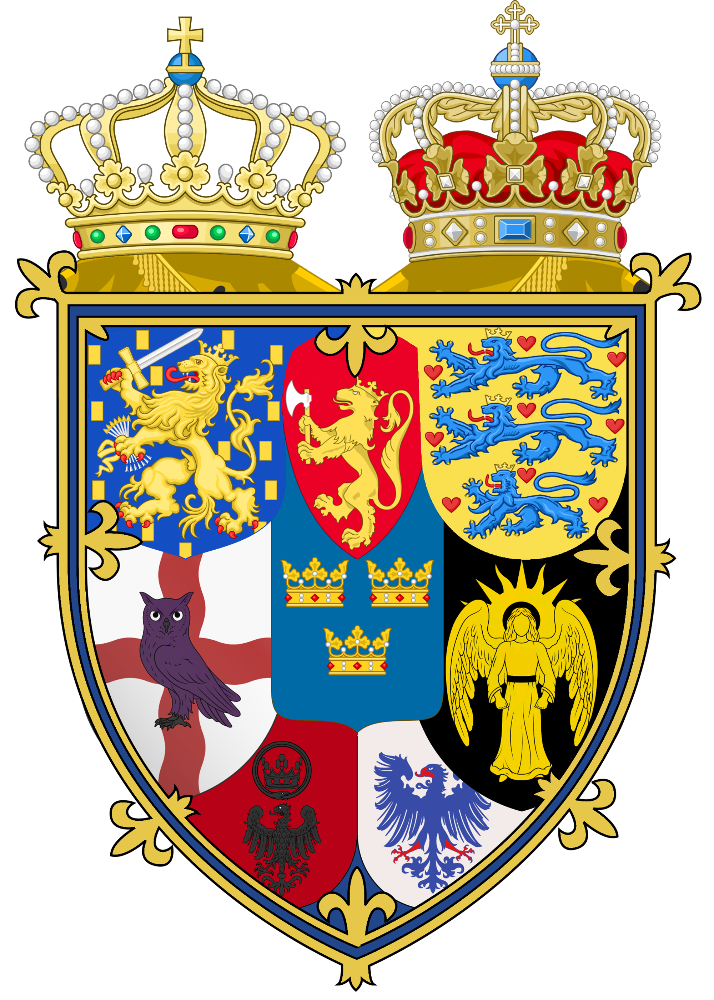

# North Sea League

<table data-view="cards"><thead><tr><th></th><th></th><th></th></tr></thead><tbody><tr><td><strong>Government</strong>: <em>Aristocratic Oligarchy</em></td><td><strong>Leaders</strong>: </td><td><strong>Towns</strong>: <a href="../towns/copenhagen.md">Copenhagen</a>, <a href="../towns/herrehus.md">Herrehus</a>, <a href="../towns/holland.md">Holland</a>, <a href="../towns/lundenwic.md">Lundenwic</a>, <a href="../towns/kallandso.md">Kållandsö</a>, <a href="../towns/smastan.md">Småstan</a>, Krakevik, <a href="../towns/c.c.f.n.md">C.C.F.N</a>, Oulu</td></tr><tr><td></td><td></td><td></td></tr><tr><td><strong>Region</strong>: <em>North Sea</em></td><td><strong>Population</strong>: 28</td><td><strong>Founded</strong>: <a href="../../../server-dates/august-24.md#aug-25">Aug 25, 2024</a>  <strong>Board</strong><em>: United by the North Sea, we commit to peace, prosperity, and collective growth. Join us in shaping a future built on strong communities and shared purpose.</em></td></tr></tbody></table>

## The Birth of North Sea League

As the server continued to grow and evolve, new towns began to emerge across southern Sweden, Denmark, and the areas surrounding the North Sea. With this increase in activity, the towns in this region found themselves drawn closer together. While there was a sense of change in the air, some inhabitants felt a need for greater security and unity. The towns around the North Sea already enjoyed strong connections, sharing resources and common interests. They valued collaboration and wanted to formalize their cooperation in a way that would ensure mutual support and a shared future.

These older nations were secretive, lacked community events, and were driven more by loans and individualism than by cooperation. In contrast, the towns around the North Sea valued transparency, mutual aid, and collective effort.

Driven by a shared vision of unity and collaboration, the towns around the North Sea began discussing the formation of a new nation. [Neko No Kuni ](../towns/neko_no_kuni.md)was initially part of these discussions, but after the first meeting, they chose to step back from the process. The founding of the nation was thus left to the towns of [Copenhagen](../towns/archived-towns/copenhagen.md), [Herrehus](../towns/herrehus.md), [Kållandsö](../towns/kallandso.md), [Lundenwic](../towns/lundenwic.md), [Holland](../towns/holland.md) and [Småstan](../towns/smastan.md).

A Discord server was quickly established to facilitate discussions on how to shape this new nation. Debates ensued over the nation’s direction, the design of its banner and Coat of Arms, and, most importantly, the name. After much deliberation, the name "North Sea League" was chosen, reflecting the shared interests and cooperative spirit of its founding towns.

On August 25th, the nation was officially formed with a ceremony held at the Altes Museum in Copenhagen, marking the birth of the North Sea League—a union built on the principles of community, collaboration, and mutual support.

On January 7th 2025, [C.C.F.N ](../towns/c.c.f.n.md)joined the nation.

Oulu joins the nation on January 10th 2025?
