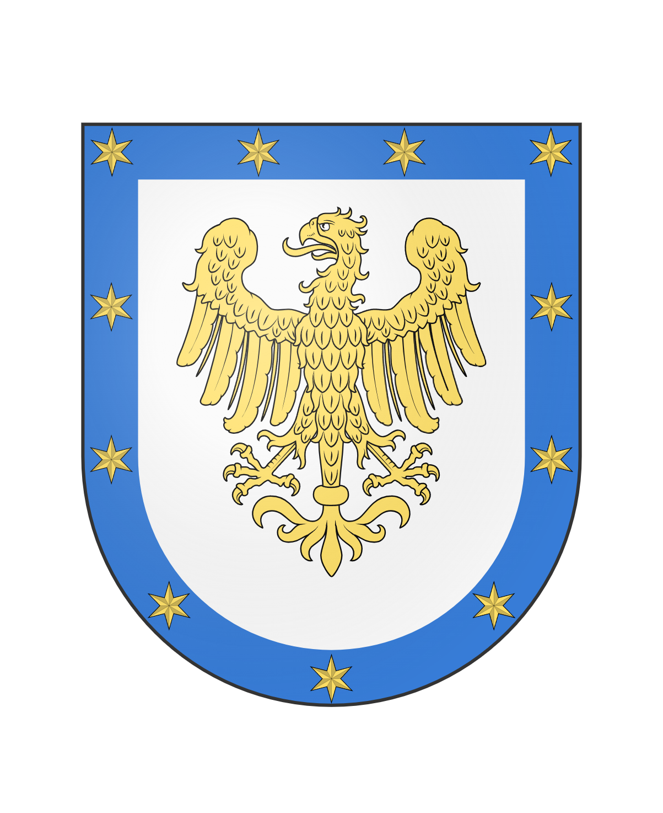

# Constellation

<table data-view="cards"><thead><tr><th></th><th></th><th></th></tr></thead><tbody><tr><td></td><td>Government: <em>Technocracy</em></td><td>Leaders: <a href="../../players/svardmastaren.md">Svardmastaren</a>, <a href="../../players/seeyouman.md">SeeYouMan</a> Towns: <a href="../../towns/sweden-region/northstar/">Northstar</a>, <a href="../../towns/finland-region/normannburg.md">Normannburg</a>, <a href="../../towns/garvia/">Garvia</a>, <a href="../../towns/other-regions/neko-no-kuni.md">Neko No Kuni</a> Previous towns: <a href="../../towns/sweden-region/smastan-knapplann.md">Småstan</a>, <a href="../../towns/finland-region/sheepomen-town/">Sheepomen Town</a>, <a href="../../towns/british-isles-region/pickle.md">Pickle Empire</a></td></tr><tr><td></td><td></td><td></td></tr><tr><td>Region: <a href="../../towns/sweden-region/">Sweden</a>, <a href="../../towns/finland-region/">Finland</a></td><td>Population: 46</td><td>Founded: <a href="../../../../server-dates/october-23.md#oct-10">Oct 10, 2023</a></td></tr></tbody></table>

**The Birth of the Constellation nation**

The Constellation Empire was established on October 10th, 2023, following [Garvia's ](../../towns/garvia/)departure from the nation of Kala due to disloyalty. Seeking alliances elsewhere, Garvia swiftly received a response from Northstar, leading to the agreement to form a new nation to gain various bonuses, including more town plots and better connectivity between towns. On October 9th, the nation received name suggestions such as Constellation, Starhaven, Nordic Union, Cassiopeia, Polaris, Free States of Astraeus, Northstar Order, and Karla. The poll concluded on the 10th of October, and the nation was promptly created thereafter.

Following its creation, the Constellation flag was designed, featuring an eagle and stars surrounding it, symbolizing all the towns within the nation. Subsequently, the builders initiated the construction of a railroad between Garvia and Northstar, aiming to secure connection between the towns. Soon after other towns on the server, such as [Småstan](../../towns/sweden-region/smastan-knapplann.md), Pickle Empire, and [Normannburg ](../../towns/finland-region/normannburg.md)joined the nation.
