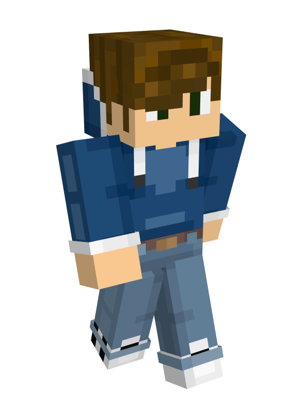

# 👤 Bamson

<table data-view="cards" data-full-width="false"><thead><tr><th></th></tr></thead><tbody><tr><td>
<strong>Registered:</strong> Sep 14, 2023

<strong>Alias</strong>: _Bamson

<strong>Nation</strong>: <a href="../nations/constellation.md">Constellation</a>

<strong>Town</strong>: <a href="../towns/garvia/">Garvia</a>

<strong>Occupation</strong>: Builder &#x26; Architect <strong>Supporter</strong>:  <strong>Discord</strong>: bamson
</td></tr><tr><td></td></tr></tbody></table>

**2022 Nordics Server:**

_**Hansan Traders:**_

Before the server launch, he was one of the founding members of Hansan Traders and during the server, Bamson was a trader and a builder for Hansan Traders. He had a talent for identifying the best locations and the most lucrative goods to trade. Making use of his wood-chopping skills. He supplied the server with abundant cheap wood, which helped him earn a reputation as a trustworthy and helpful merchant. Additionally, he also designed and constructed the Kalasseum for Hakkapelitatt.

\
**2023 Nordics Server**

_**Garvia:**_\
Bamson arrived in a newly made town with the name of Garvia where many of his former companions from Hansan settled. With much expectation and a bustling town, Bamson felt right at home. Quickly after entering the town, he began building and immersing himself in the town's development.

As a skilled builder and a mind for business, he set to work on his first building which was the Fishing hut. From previous knowledge, he knew how vital fishing was and wanted to create a cozy and welcoming place to catch fish.

After completing the first project, Bamson wanted to ensure Garvia's borders and connect Garvia with the rest of the server. It was done by making a gate at a highly used path going from North Karelia to Aquaria. As it was right in an intersection, he gave it the name [Cometfall Crossroads](../towns/garvia/cometfall-crossroads.md). Which became a safe and secure passage across the eastern side of the [Finland Region](../towns/archived-towns/finland-region/).

During the first days of the town. MineSkate planned and built the [Church of Garvia](../towns/garvia/church-of-garvia.md). Building a church alone was a challenging task, Bamson noticed the time it took to build it and felt that the church required some more detailing, so took the initiative to design the details.

In addition to these buildings, Bamson built the market, train station that was connected with Northstar, and the lighthouse along the coast of the northern island.

February 2024, Bamson rebuilt two town buildings and continued with the Cometfall Crossroads, featuring The Blazeheart Forge.

<figure><figcaption>
Newer version
</figcaption></figure>

<figure><figcaption>
The Blazeheart Forge
</figcaption></figure>

***
