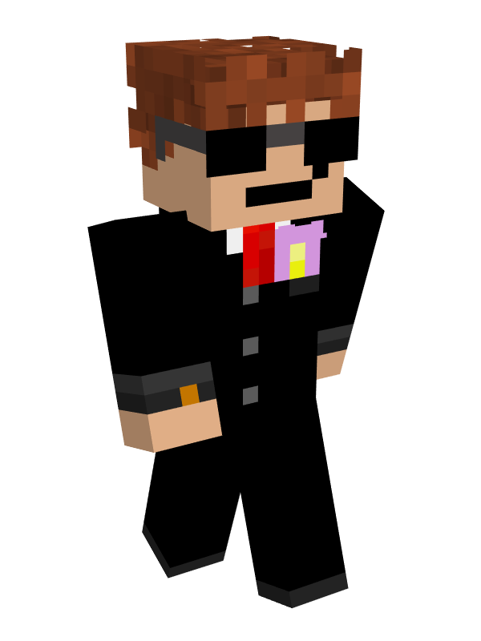

# 👤 CosmicWaffles

<table data-view="cards" data-full-width="false"><thead><tr><th></th></tr></thead><tbody><tr><td>
<strong>Registered:</strong> Sep 8, 2023

<strong>Alias</strong>: _Cosmic_Waffles

<strong>Nation</strong>: <a href="../nations/present-nations/constellation.md">Constellation</a>

<strong>Town</strong>: <a href="../towns/finland-region/province-of-garvia/thornfield.md">Thornfield</a>

<strong>Occupation</strong>: Mayor
</td></tr><tr><td></td></tr></tbody></table>

### Early presence

At the start of the server launch, Cosmic played a significant role in leading the Kala people to settle in [Aquaria](../towns/finland-region/aquaria/). Later on, he created the path for the next town by the name of [Muurmanni](../towns/finland-region/muurmanni.md), which would expand [Kala](../nations/absent-nations/kala.md)'s borders up north. Later still, he founded another town called Normannburg, situated south of Aquaria. Cosmic's contribution to the towns was notable and earned him respect among the community.

### Events

One of the most controversial events in the server's history is known as "The Danish forest fire," which involved three players, including Cosmic, communistraika, and CrispyChickes. During this event, the trio burned down all the forests in the Denmark region, with Cosmic starting 1245 independent fires, accounting for approximately 37% of all user-placed fires on the server. Communistraikia started 1203 independent fires, accounting for approximately 35%, and CrispyChickes started 912 independent fires, accounting for approximately 27% of all user-placed fires on the server. In summary, these three players alone were responsible for lighting almost all the server's fires, and they spent hours doing it.\
\
The community's response to the incident was to conduct targeted rollbacks to undo fire damage in specific areas while preserving legitimate burns. However, this operation caused intermittent server lag and took a while to complete.

Pictures from event

### Server contribution

Cosmic was one of the founders of the Nordics server and created the custom world map.
