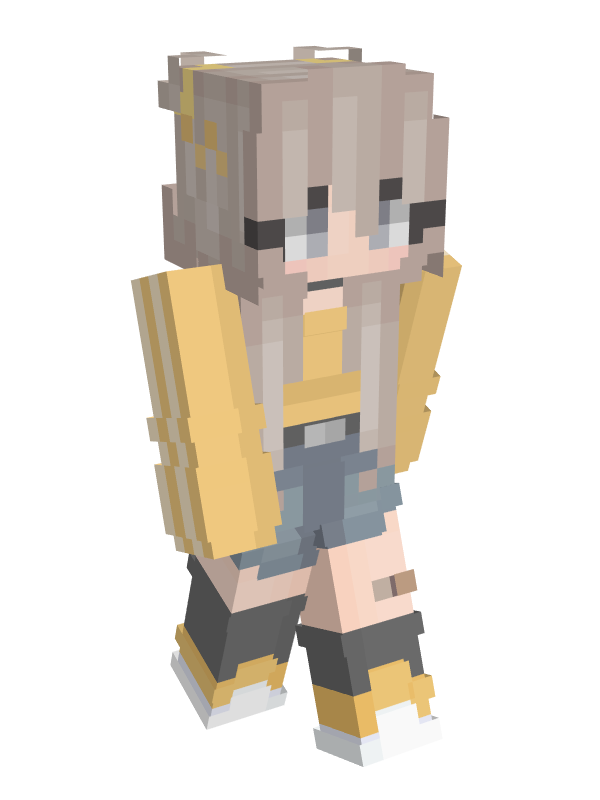

# 👤 FiskerGuten

<table data-view="cards" data-full-width="false"><thead><tr><th></th><th data-hidden data-card-cover data-type="files"></th></tr></thead><tbody><tr><td>
<strong>Registered:</strong> Oct 28, 2023

<strong>Alias</strong>: FiskerGuten

<strong>Nation</strong>: <a href="../nations/present-nations/kesko-corporation/">Kesko Corporation</a>

<strong>Town</strong>: <a href="../towns/finland-region/helsinki.md">Helsinki</a>
</td><td></td></tr><tr><td></td><td></td></tr><tr><td></td><td></td></tr></tbody></table>

FiskerGuten founded the town Helsinki on November 4, 2023.
