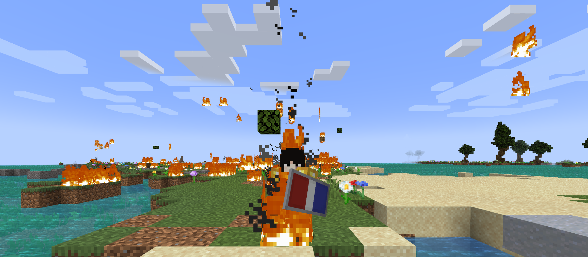

# 👤 NL\_Kommiedant

<table data-view="cards" data-full-width="false"><thead><tr><th></th><th data-hidden data-card-cover data-type="files"></th></tr></thead><tbody><tr><td>
<strong>Registered:</strong> <a href="../../../misc/server-dates/may-24.md#may-17">May 17, 2024</a>

<strong>Alias</strong>: NL_Kommiedant

<strong>Nation</strong>: <a href="../nations/present-nations/north-sea-league.md">North Sea League</a>

<strong>Town</strong>: <a href="../towns/other-regions/amsterdam.md">Holland</a>
</td><td></td></tr><tr><td></td><td></td></tr></tbody></table>

NL\_Kommiedant joined the server on [May 17, 2024](../../../misc/server-dates/may-24.md#may-17), with the aim of restoring the Netherland region and ruling as the Queen of Nederland. To enable the restoration, NL\_Kommiedant utilized the destructive power of fire to clear out any obstacles hindering progress.

<figure><figcaption>
To rebuild I must destroy. Maya for Queen of Nederland 2024
</figcaption></figure>
