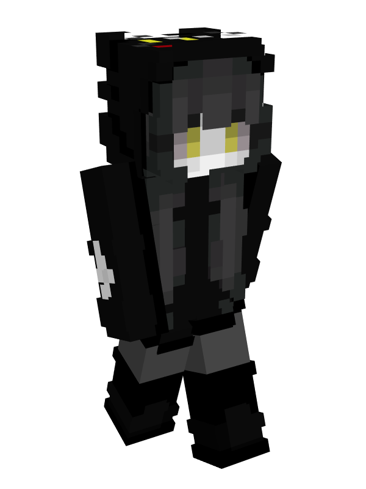

# 👤 WhoKnew

<table data-view="cards"><thead><tr><th></th></tr></thead><tbody><tr><td>
<strong>Registered:</strong> Sep 8, 2023

<strong>Alias</strong>: _WhoKnew_/1_WK_1

<strong>Nation</strong>: <a href="../nations/present-nations/constellation.md">Constellation</a>

<strong>Town</strong>: <a href="../towns/other-regions/neko-no-kuni.md">Neko No Kuni</a>
</td></tr><tr><td></td></tr></tbody></table>

WhoKnew joined the server for the first time on September 8, 2023, and co-founded the Pickle Empire on the first day of the server. WhoKnew left the server after the first day and would not join again until August 2024, during the [Sápmi forest fire](../../../server-events/terrain-incidents/the-sapmi-forest-fire.md).

On August 14, 2024, WhoKnew would found a new town called [Neko No Kuni](../towns/other-regions/neko-no-kuni.md).
