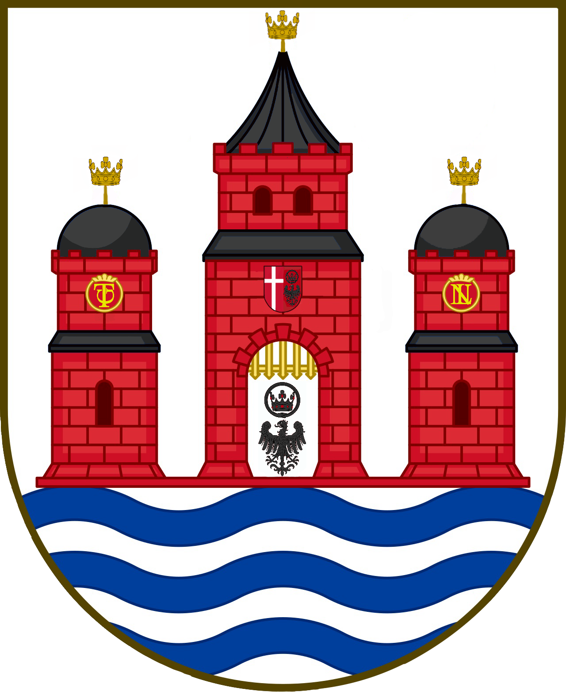

# Copenhagen

<table data-view="cards"><thead><tr><th></th><th></th><th></th></tr></thead><tbody><tr><td><strong>Founders</strong>: <a href="../players/aytte/">Aytte </a>&#x26; <a href="../players/lordnovember.md">LordNovember64</a></td><td></td><td>Member of <a href="../nations/north-sea-league.md">North Sea League</a></td></tr><tr><td></td><td></td><td></td></tr><tr><td>
<strong>Region</strong>: <a href="archived-towns/denmark-region/">Denmark</a>

<strong>Residents</strong>: 6 <strong>Founded</strong>: <a href="../../../server-dates/may-24.md#may-4">May 4 2024</a>
</td><td><strong>Motto</strong>: <em>"Where diverse paths meet to forge a new legacy"</em></td><td></td></tr></tbody></table>

## Background

Copenhagen was founded on May 4, 2024, by [Aytte](../players/aytte/), following the fall of the old town of [København](archived-towns/copenhagen.md), which had been abandoned after its players stopped playing and its upkeep lapsed. For six months, [København](archived-towns/copenhagen.md) lay in ruins, until [LordNovember64 ](../players/lordnovember.md)decided to restore the town after griefers had destroyed most of its buildings. As the restoration progressed, Aytte recognized the importance of claiming the land to prevent further griefing, especially with the known threat of [raika\_ ](../players/raika_.md)targeting unclaimed areas.

During the restoration, LordNovember64 built a flag to symbolize the town’s revival. With each phase of the reconstruction, the flag was raised higher, only reaching the top when the restoration was complete. Thanks to Aytte’s financial and material support, LordNovember was able to build three new town structures: the Altes Museum, Börsen, and a government building.

Once the restoration was finished, the Altes Museum was adorned for a special ceremony marking the formation of the [North Sea League](../nations/north-sea-league.md). After the ceremony, Copenhagen officially became the capital town of the newly founded nation.
