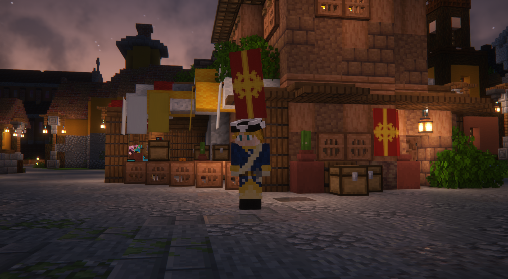
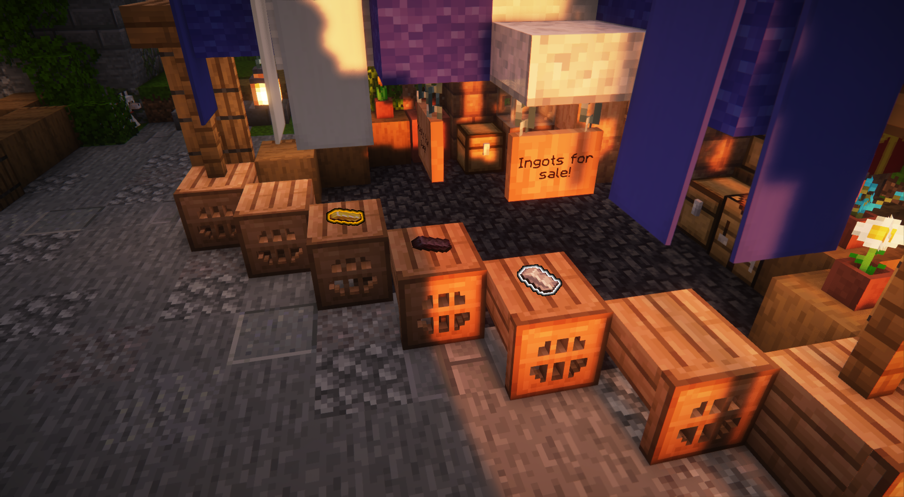
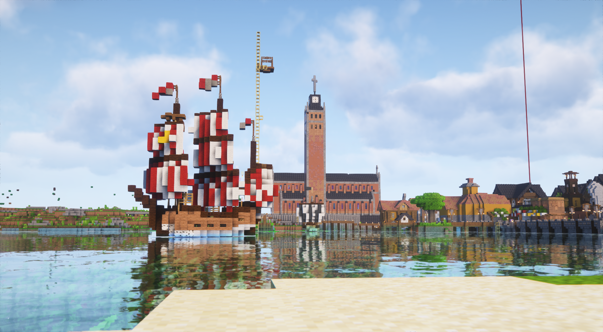
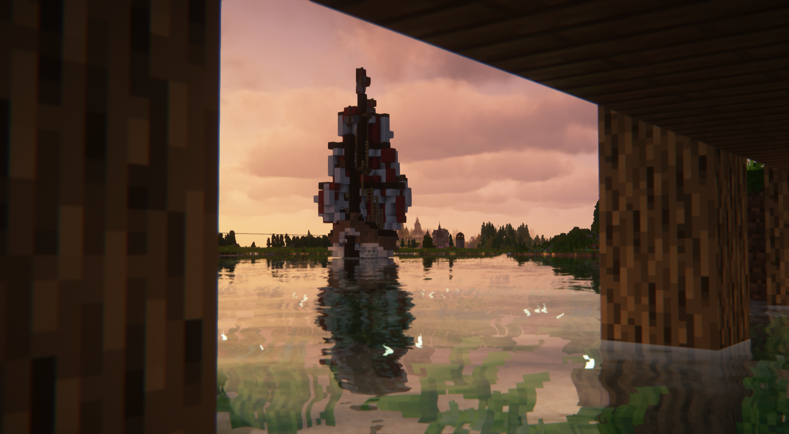

# ☑ Garvia

<table data-view="cards"><thead><tr><th></th><th></th><th data-hidden></th></tr></thead><tbody><tr><td><strong>Founder:</strong> <a href="garvian-residents/aytte.md">Aytte</a></td><td><strong>Mayor:</strong> MineSkate1  <strong>Member of</strong> <a href="../../../nations/present-nations/constellation.md"><strong>Constellation</strong></a>  <strong>Outposts:</strong> <a href="cometfall-crossroads.md">Cometfall Crossroads</a></td><td></td></tr><tr><td></td><td></td><td></td></tr><tr><td>
<strong>Region:</strong> <a href="../">Finland</a>

<strong>Residents at peak:</strong> 11
</td><td><strong>Founded:</strong> <a href="../../../../../additional-guides-and-commands/others/server-dates/september-23/#sep-10">Sep 10 2023</a></td><td></td></tr></tbody></table>

***

<figure><figcaption>
Overview image November-23
</figcaption></figure>

***

### History

### Lore

This is the tale of a place where faith and industry intertwine. A place where the echoes of history still whisper through the streets and gardens. It is a testament to the indomitable spirit of those who found their way to this land, carving a vibrant tapestry of life upon its sacred soil.

In a time long past, in a land steeped in mysticism and reverence, a sacred site lay untouched. It is here that the seeds of a remarkable story were sown. Upon this holy ground, the foundations of a humble church were laid. As the church rose from the earth, so did the first tentative farms, tended by dedicated priests and monks who had come to call this place home. With devotion and labor, they cultivated the land. breathing life into their spiritual haven. Yet, it was not just the pious who were drawn to this burgeoning sanctuary. As word spread of the fertile fields and bountiful blessings, others too were enticed by the promise of prosperity. Soon a harmonious community began to take shape. As the settlement prospered, its significance grew beyond the spiritual realm. To ease the passage of sea travelers, a grand canal was carved, offering a lifeline of commerce and connection. In its wake, a bustling harbor emerged, brimming with the riches of distant lands. But with growth came vulnerability and the threat of raids loomed ominously...

**Buildings**



Architect: MineSkate1

Designer: \_Bamson

Builders: Aytte, MineSkate1, EiraHS, Bamson\_




alexxxandra

<figure><figcaption></figcaption></figure>

<figure><figcaption></figcaption></figure>











<figure><figcaption></figcaption></figure>

<figure><figcaption></figcaption></figure>

<figure><figcaption></figcaption></figure>

<figure><figcaption></figcaption></figure>

<figure><figcaption></figcaption></figure>



