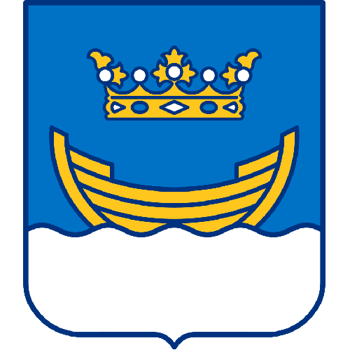
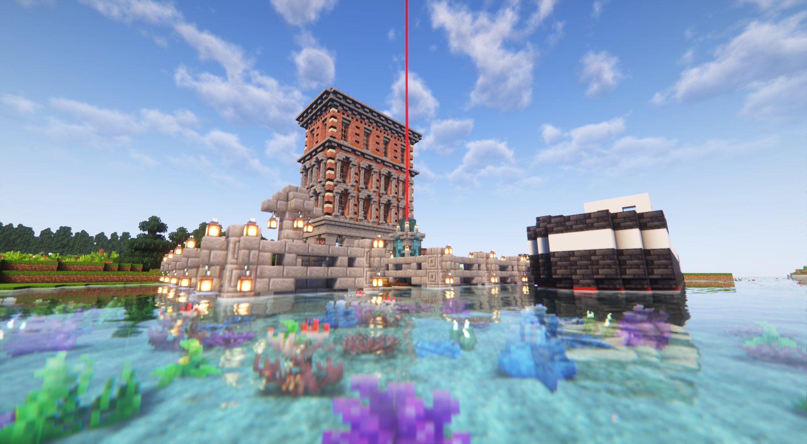

# ☑ Helsinki

<table data-view="cards"><thead><tr><th></th><th></th><th></th></tr></thead><tbody><tr><td><strong>Founder</strong>: Fiskerguten</td><td><strong>Mayor</strong>: Fiskerguten</td><td> <strong>Member of Kesko Corp</strong>  <strong>Outposts</strong>: 2</td></tr><tr><td></td><td></td><td></td></tr><tr><td><strong>Region</strong>: <a href="./">Finland</a> <strong>Residents</strong>: 4 <strong>Founded</strong>: Nov 4 2023</td><td></td><td></td></tr></tbody></table>



<figure><figcaption></figcaption></figure>






