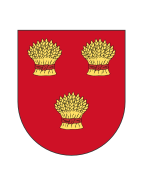

# Thornfield

Founded by Aytte on December 17, 2023, Thornfield was established at the entrance of the Province of Garvia as a peaceful hamlet focused on farming and providing a safe haven for travelers. Located in Finland's flatlands, it served as a key crossroad between Normannburg and Garvia. The town was later entrusted to Cosmic\_Waffles and CrispyChickes but eventually fell into abandonment. Later, two residents from Normannburg sought a new beginning and, with Golli's approval, established an outpost at Thornfield’s location, breathing new life into the area.

<figure><figcaption>
Town Emblem
</figcaption></figure>
