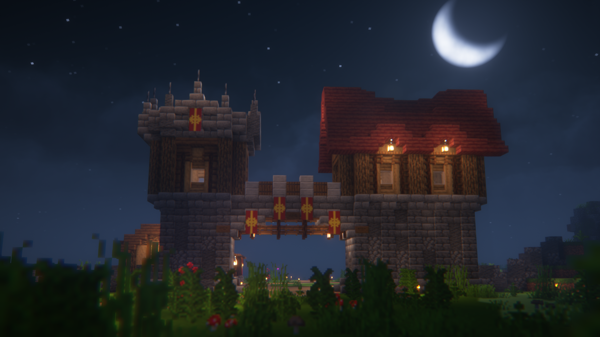
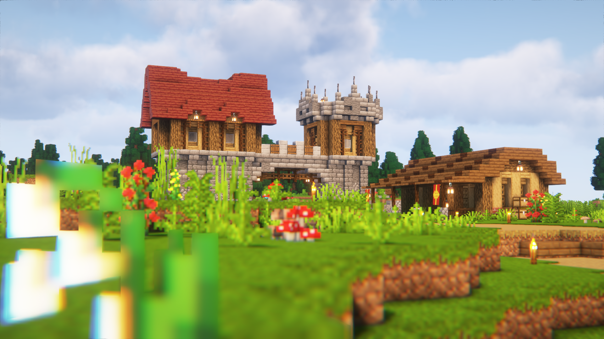

# Cometfall Crossroads

The Cometfall Crossroads was built by the Garvian resident Bamson and is located in the eastern Finland Region. The gate serves as a protection and safe passage through Garvia.

The idea behind the building was to create an opportunity for travelers to rest and park their horses within its walls, where no mobs or outlaws could cause harm. At the same time, MineSkate and Aytte sought to define the borders of the town and later on protect the Province, which the gate would fulfill.

Not only does it have a function, but it's a welcoming sight for all travelers on their journey across the region.

<figure><figcaption>
February 2024
</figcaption></figure>

Images

<figure><figcaption></figcaption></figure>

<figure><figcaption></figcaption></figure>
