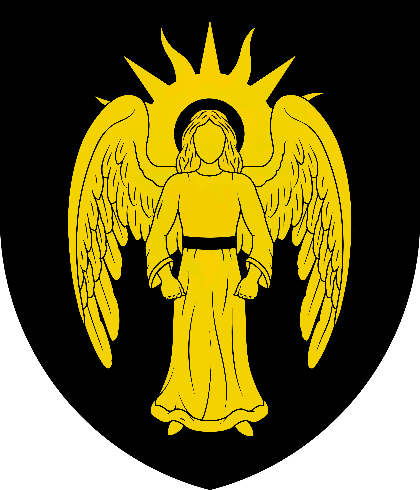

# Kållandsö

<table data-view="cards"><thead><tr><th></th><th></th><th></th></tr></thead><tbody><tr><td>Founder: <a href="../players/mineskate.md">Femfe</a></td><td>Member of <a href="../nations/north-sea-league.md">North Sea League</a></td><td></td></tr><tr><td></td><td></td><td></td></tr><tr><td>Region: <a href="archived-towns/sweden-region.md">Sweden</a></td><td>Founded: <a href="../../../server-dates/august-24.md#aug-19">Aug 19 2024</a></td><td>Motto: " "</td></tr></tbody></table>

## Background

On [August 19th, 2024](../../../server-dates/august-24.md#aug-19), Femfe (also known as [MineSkate](../players/mineskate.md)) founded the town of Kållandsö. \
Situated on the Kållandsö peninsula, this town takes advantage of the strategic location where the railway and Göta Canal cross paths. \
Femfe, an experienced Garvian-native builder with works such as the Church of Garvia in his portfolio, saw the potential to create a toll point. \
Months before the town was founded, the builder had already envisioned a magnificent castle, looking over the lake of Vänern, embodying the power and wealth that the toll point would bring. \
He also saw the possibilities of making the canal beautiful and the railway bridge too, using the foundations laid by the former stewards of the land. \
So, the castle was rapidly constructed, using the vast diorite deposits conveniently located beneath the peninsula, and a toll point on the canal and railway was established. \
Not forgetting his goal of improving the canal and bridge, locks were put in place throughout the canal to facilitate boat travel between different water levels. The bridge received proper arched supports.&#x20;

In a display of loyalty towards his hometown and province to [Garvia](garvia/), Femfe decided to adopt a flag mimicking that of the one belonging to the Church of Garvia (an angel imposed on a radiant sun), only with the colors changed to black and gold.

In accordance to the mayor’s goals of improving infrastructure and working for the greater good of the Nordic world, Kållandsö would join the North Sea League.
