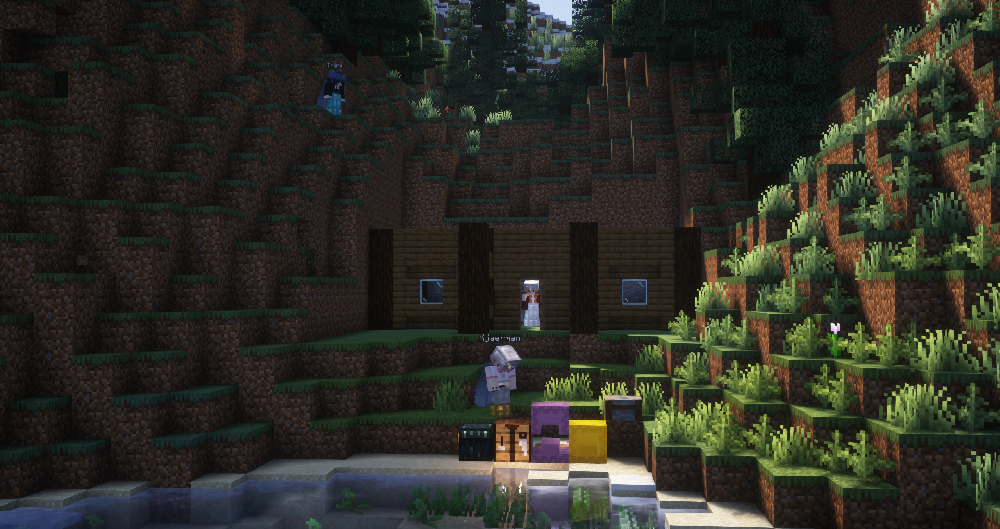
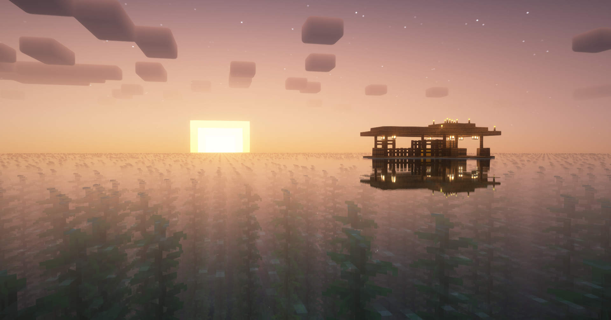

# Neko No Kuni

_Meow!!!! - Motto of Neko No Kuni_

<table data-view="cards"><thead><tr><th></th></tr></thead><tbody><tr><td>
<strong>Founded</strong>: <a href="../../../server-dates/august-24.md#aug-14">Aug 14 2024</a>

<strong>Founder</strong>: <a href="../players/whoknew.md">_WhoKnew_</a>

<strong>Mayor</strong>: <a href="../players/whoknew.md">_WhoKnew_</a>

<strong>Member of</strong> <a href="../nations/constellation.md">Constellation</a>
</td></tr><tr><td></td></tr><tr><td>Residents: 8</td></tr></tbody></table>

Neko No Kuni was created on August 14, 2024, by \_WhoKnew\_ and Kjaerman. The town is situated in the eastern parts of Greenland making it the most northern and western town on the server. This location was chosen because of its remote location.

Neko No Kuni is currently[^1] a part of [Constellation](../nations/constellation.md) but seeks to form their nation in the future.

The town quickly became a hub for embassies. On its first day, it had already established two embassies. The first embassy created was from [Garvia](garvia/) followed by an embassy from [Holland](holland.md).

<figure><figcaption>
The founding of the town
</figcaption></figure>

<figure><figcaption>
One of Neko No Kuni's fishing outposts
</figcaption></figure>

<figure><figcaption>
The towns first embassy
</figcaption></figure>

[^1]: August 15, 2024
