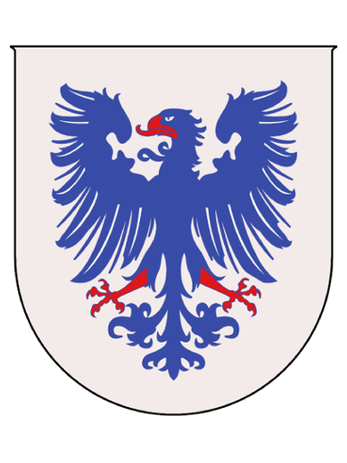

# Småstan

<table data-view="cards"><thead><tr><th></th><th data-hidden data-card-cover data-type="files"></th></tr></thead><tbody><tr><td>
Founded: <a href="../../../server-dates/october-23.md#oct-12">Oct 12, 2023</a>

Re-Founded: <a href="../../../server-dates/august-24.md#aug-15">Aug 15 2024</a>

Founder: <a href="../players/crispychickes.md">CrispyChickes</a>

Mayor: <a href="../players/crispychickes.md">CrispyChickes</a>  <strong>Member of</strong> <a href="../nations/north-sea-league.md">North Sea League</a>
</td><td></td></tr><tr><td></td><td></td></tr><tr><td>Residents: 1</td><td></td></tr></tbody></table>

Småstan was created for the first time on October 12, 2023, and later re-founded on August 15, 2024, both times by [CrispyChickes](../players/crispychickes.md). The town is situated in the central western part of [Sweden](archived-towns/sweden-region.md) close to the [Norwegian](archived-towns/norway-region/) border. The town was deserted in early December 2023 due to a lack of funding before being re-established in August 2024.

When Småstan was first founded, it was originally named Knapplann, as suggested by the player [\_Cosmic\_Waffles](../players/cosmicwaffles.md). The name was changed to Småstan a couple of days later. The name Småstan comes from the Swedish words "Små" and "Stad," which in English means "Small town." The town was named this because it was smaller compared to the large towns that existed during its creation.

The town of Småstan has three different flags: a military flag, a state flag, and a naval flag. Each of these flags has a unique description and specific manufacturing method.

<figure><figcaption>
The town of Småstan
</figcaption></figure>
