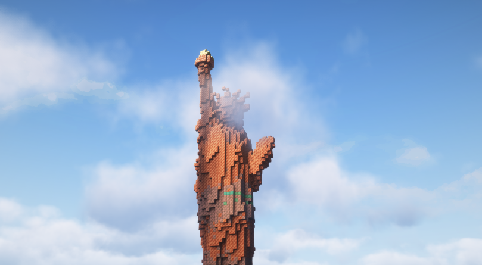

# 🗽 Statue of Liberty

The statue is located on St.Petersburg island in [Finland Region](../archived-towns/finland-region/). It was planned and built by [Occypolojee](../../players/occypolojee.md). Planning started approximately on December 10th, the foundation building began approximately on December 14th and was completed on 24th of February 2024

The statue is made up of 3372 copper blocks, which equals 52.7 stacks in total.

<figure><figcaption></figcaption></figure>

 

<figure><figcaption></figcaption></figure>

