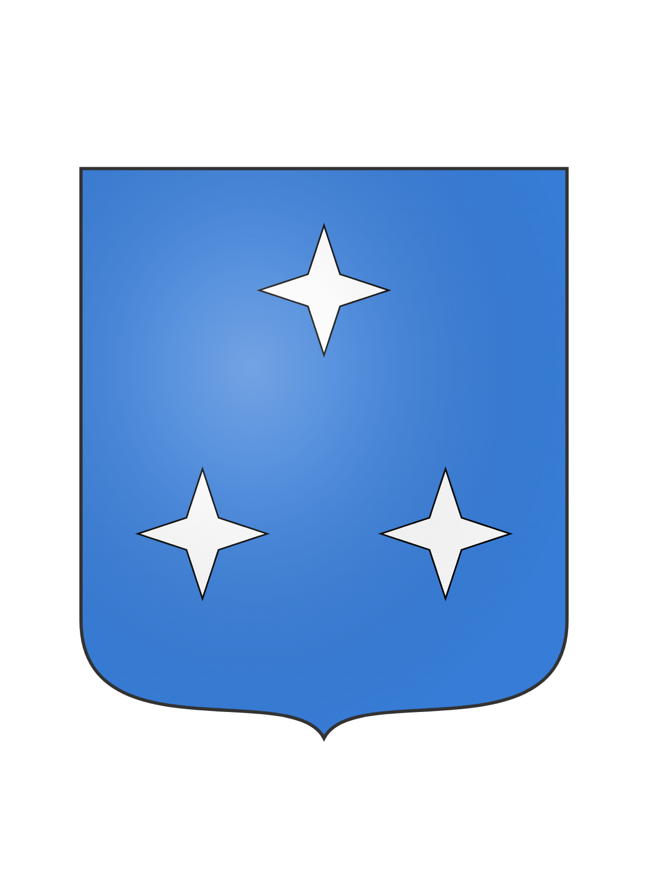

# ☑️ Northstar

<table data-view="cards"><thead><tr><th></th><th></th><th></th><th data-hidden data-card-cover data-type="files"></th></tr></thead><tbody><tr><td><strong>Founder</strong>: <a href="../../../players/svardmastaren.md">Svardmastaren</a>, <a href="../../../players/seeyouman.md">SeeYouMan</a></td><td><strong>Mayor</strong>: <a href="../../../players/volymskala.md">Volymskala</a> </td><td><strong>Capital of</strong> <a href="../../../nations/present-nations/constellation.md"><strong>Constellation</strong></a>  <strong>Outposts</strong>: <a href="northstar-industries/northstar-industries-mining-division.md">NSI-M</a>, Northstar Fishing, Northstar Nether</td><td></td></tr><tr><td></td><td></td><td></td><td></td></tr><tr><td><strong>Region</strong>: <a href="../../../maps/regions/sweden.md">Sweden</a></td><td><strong>Residents</strong>: 16</td><td><strong>Founded</strong>: <a href="../../../../../additional-guides-and-commands/others/server-dates/september-23.md#sep-9">Sep 9 2023</a>  <strong>Motto</strong>: <em>"Shop at Northstar"</em></td><td></td></tr></tbody></table>

***

After the announcement of the relaunch of the Nordic Union Minecraft server the old members of the [Golden Union](../../../../../misc/the-2022-nordics-server/golden-union.md) started background talks about reintroducing the once powerful nation. The demand from the users was lackluster to say the least with few members actually agreeing on the venture. At the end only two people stood behind the decision of creating a settlement together, [Seeyouman](../../../players/seeyouman.md) and [Svardmastaren](../../../players/svardmastaren.md) founded the city of Northstar on September 9th, 2023.

Today the town consists of a mix of citizens from other towns and newcomers to the realm that joined the peaceful town. All with the common goal of remaining peaceful and building a friendly community for all.

Citizens (In joined order)

[Svardmastaren](../../../players/svardmastaren.md) - Founder

[SeeYouMan](../../../players/seeyouman.md) - Founder

Luddpudd - Special Star Miner

WiliamThur - Citizen

[Volymskala](../../../players/volymskala.md) - Ex-Queen

Areaskala - Ex-Prince

Kabbe2121 - Builder

JeTaRiPoKa - Berry Clown

Large Pickle - Citizen

Jakeybobble - The sewer dweller

GoldFire - Mythological creature

BlueFire\_Phoenix - Citizen

BlueFrostDragon - Citizen

lil\_perre - Citizen

joelsedig - Citizen

TriiTrii - Finnish greatness

<figure><figcaption>
Overview image May-2024
</figcaption></figure>

***

Founding principles

Northstar was founded with some very specific principles in mind, [Seeyouman](../../../players/seeyouman.md) and [Svardmastaren](../../../players/svardmastaren.md) had a long discussion of what the town's goals and focuses would be. Being situated between the major towns of [Copenhagen](../../denmark-region/copenhagen.md) and [Aquaria](../../finland-region/aquaria.md) a goal of remaining neutral was quickly set in stone. Northmen would work together to maintain peace and the neutral image of Northstar as a town.

Democracy was therefore important and would let all members have their say in the town's development and major decision of diplomacy. Even down to the fact of accepting new members into the town, a majority of members should agree on a person joining the settlement. Only trustworthy members would therefore be let in and partake in the town’s construction.

Resources were to be shared between members, being part of Northstar shouldn't be an economical burden to the citizen therefore all citizens are encouraged to donate money to the town’s bank for survival but not required. Taxing the citizens was therefore not an option, the same would later include no tax for towns under the Constellation roof.

The founders also agreed on never becoming a nation, this was to remain small and keep neutrality since the memory of [Golden Union](../../../../../misc/the-2022-nordics-server/golden-union.md) getting attacked was still fresh in the founders minds.

Lore

Northstar's original founding is currently unknown, from what archaeology has gathered it was once a mighty fishing, industrial and merchant outpost. Multiple instances of buried docks and stands have been found during the construction of the new sewer system. Its positioning seems quite strategic with close connection to most parts of the world and the proximity to waterways.

The original settlement seems to have consisted of a main building surrounded by smaller tent like structures up to minor houses. All trade and storage was done in the main building where all the citizens seemed to have shared everything. Outside the main building was a tiny marketplace that is predicted to be popular considering all the resources that don't belong to the town like wheat, ice, blueprints and berries. Surrounding the town was a wall that can still be seen today, it more than likely was used to keep enemies out rather than fight them. Today the wall has been restored to mark the historic part of town. Other remnants can be found around the world in the form of large statues symbolizing guiding principles of Northstar and her spiritual leader Kabbe.

**Northstar luck**

A strange phenomenon was discovered in quick succession after the Northmen had started to fish. It seemed like its citizens were above average luck when it came to fishing. A majority of the citizens in Northstar have fished up at least one mending book each and multiple people have fished five or more. This folklore has spread outside of the town's border where people from everywhere in the realm travel to Northstar to fish and test their luck.

History

**Founding**

The founding of Northstar was done by [Svardmastaren](../../../players/svardmastaren.md) and [Seeyouman](../../../players/seeyouman.md) September 9th 2023. It was founded on the principle of being a small town with close connection between its citizens, the town started in a tiny hole that the founder hid in which today is the chicken coupe. Outside of this the initial house was brought up, slowly new members joined the founders and the town got its market, main house and then the walls were restored.

Northstar was chosen as the town's name before its founding, symbolizing the guiding star of the world. Northstar would help guide people toward common goals and unite them in collaborative projects. The town's location, where most infrastructure would converge, would guide people to their destinations and serve as a safe haven. Additionally, the name symbolized the town as a haven between earth and space.

[**Mora**](../mora.md) **merger**

A few weeks into the town's existence the founders got to know about a small settlement out in the middle of the forest called [Mora](../mora.md). Mora’s Queen [Volymskala](../../../players/volymskala.md) had founded [Mora](../mora.md) to be a lumber empire, selling cheap wood to all, but due to the loneliness in the forest and the difficulty in traveling to and from [Mora](../mora.md), [Volymskala](../../../players/volymskala.md) started talks with [Seeyouman](../../../players/seeyouman.md) and [Svardmastaren](../../../players/svardmastaren.md) to join Northstar. Since Northstar was decided to be outside of Nation alliances, the town of [Mora](../mora.md) was disbanded and [Volymskala](../../../players/volymskala.md) moved to Northstar gaining the title Ex-Queen, and Northstar gaining its fourth citizen.

[Volymskala](../../../players/volymskala.md) continued her mission of making a lumber empire and continued to sell cheap wood, but from Northstar instead. She also brought her organizational skills to Northstar and made the first Storage house, the basement of which still stands today, now housing the Assassin School for Orphaned Dogs.

**The role to unite nations**

Northstar in the early days often acted as a neutral mediator and meeting ground for the other Nations.

**Railway is built**

The great Nordic railway project launched September 10th 2023, with the intent of connecting the greater nations of [Kala](../../../nations/absent-nations/kala.md) and [Kingdom of Denmark](../../../nations/absent-nations/denmark.md). It would consist of two stages, this was later expanded to four stages as more towns were supposed to be brought into the system. Stage one consisted of a railway bridge to [Aquaria](../../finland-region/aquaria.md) with a turn off to [North Karelia](../../finland-region/north-karelia.md), the [Kala](../../../nations/absent-nations/kala.md) branch was postponed indefinitely but due to political complications with [Aquaria](../../finland-region/aquaria.md) and [Kala](../../../nations/absent-nations/kala.md). Stage two became the main focus after the fallout and a quick connection to [Kingdom of Denmark](../../denmark-region/copenhagen.md) was built in around 2 weeks time. Stage 3 was completed by [Copenhagen](../../denmark-region/copenhagen.md), [Odense](../../denmark-region/odense.md) and [Esbjerg](../../denmark-region/esbjerg.md) as a sign of peace between [Copenhagen](../../denmark-region/copenhagen.md) and [Odense](../../denmark-region/odense.md). And then stage 4 was connecting [Garvia](../../finland-region/province-of-garvia/garvia/) into the system, the massive scale of the project meant that a lot of stretches were never completed. Rails were laid but the decorative parts were never completed, non the less the system brought [Constellation](../../../nations/present-nations/constellation.md) members closer to each other with faster transit and also a close relationship with the [Kingdom of Denmark](../../../nations/absent-nations/denmark.md).

**Terror attacks**

During the building of the Northstar-Denmark railway tunnel, a player by the name of xdaggzy attacked Northmen building the tunnel. They killed the northmen and burned their gear, this included a mending axe that was carried by [Volymskala](../../../players/volymskala.md). The player continued towards Northstar, setting fire to the unprotected Railway along the way. Well in Northstar a battle commenced between Kabbe2121 and the terrorist, who proceeded to lavacast the Northstar harbor, but fortunately the terrorist crashed and Kabbe2121 succeeded in spawn trapping him in lava inside the Magical tower of friendship.

[**Constellation**](../../../nations/present-nations/constellation.md)

[**Northstar Forest fire**](northstar-forest-fire.md)

In the spring of 2024 a fire broke out near Northstar which consumed a majority of the forest in the swedish region.

Important landmarks

**Main storage building**

The main storage building is located beside the market and contains an automated sorting system which can handle 192 different objects. The building also holds a conference room which has hosted many diplomatic talks, the conference room also contains relics and books of diplomatic agreements such as Northstar treaty and Big Baelte treaty. One of a kind relics such as Laura's Parachute pants and Kong Skjolds Kala killer can be seen in the room too.

**Northstar luck fishing float**

The Northstar luck fishing float was built to maximize reward from fishing, it started out as a chunk of lily pads but the constant threat of phantoms meant the float was needed. It was therefore constructed with the sole purpose of not affecting the fishing loot and to accommodate an ender chest and storage. All in all around 13 mending books have been caught at the float to date and therefore lures people from across the realm to fish at this lucky spot.

**Northstar main station**

Northstar main station was built in conjunction with the rail project, the station consists of two tracks one going west and one going east with a automatic passthrough. It would serve as a central point of the railway and mark Northstar as a transit hub and merchant town. Noteworthy features of the building was the first mosaic Northstar logo on top of the glass roof that can be seen on maps or from above, the building also had the first water elevators in the realm due to Northstar having a monopoly on soulsand.

**Sewer**

A sewer system was constructed under a majority of Northstar by Jakeybobble, noteworthy additions is the large water collection chamber that holds the towns jail and the storage of defensive arms.

**Shop at Northstar**

**Northstar IKEA**

**The tri ponds**

Companies

**Parent Company**

[Northstar Industries (NSI)](northstar-industries/)

**Subsidiaries**

[Northstar Industries - Sales Division](northstar-industries/northstar-industries-sales-division.md)

[Northstar Industries - Mining Division](northstar-industries/northstar-industries-mining-division.md)

[Northstar Industries - Banking Division](northstar-industries/northstar-industries-banking-division.md)

[Kabbe2121’s Disk shop](northstar-industries/kabbe2121s-disk-shop.md)

[Mora Trä](northstar-industries/mora-trae.md)

[Magical Tower of friendship](northstar-industries/magical-tower-of-friendship.md)

[Medieval IKEA](northstar-industries/medieval-ikea.md)

***
