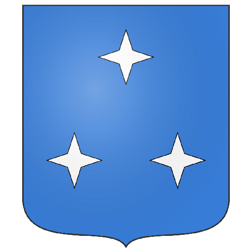

# ☑️ Northstar

<table data-view="cards"><thead><tr><th></th><th></th><th></th></tr></thead><tbody><tr><td><strong>Founder</strong>: Svardmastaren</td><td><strong>Mayor</strong>: </td><td><strong>Capital of</strong> <a href="../../../nations/present-nations/constellation.md"><strong>Constellation</strong></a>  <strong>Outposts</strong>: <a href="northstar-industries/northstar-industries-mining-division.md">NSI-M</a>, Northstar Fishing, Northstar Nether</td></tr><tr><td></td><td></td><td></td></tr><tr><td><strong>Region</strong>: <a href="../../../maps/regions/sweden.md">Sweden</a></td><td><strong>Residents</strong>: 15</td><td><strong>Founded</strong>: <a href="../../../../../additional-guides-and-commands/others/server-dates/september-23.md#sep-9">Sep 9 2023</a>  <strong>Motto</strong>: <em>"The stars do shine upon us"</em></td></tr></tbody></table>

***

<figure><figcaption>
Overview image Dec-2023
</figcaption></figure>

***

## History

### Summary

### Northstar Industries

### Northstar Treaty

### The Sewers

***

## Politics

### Council of Northstar
