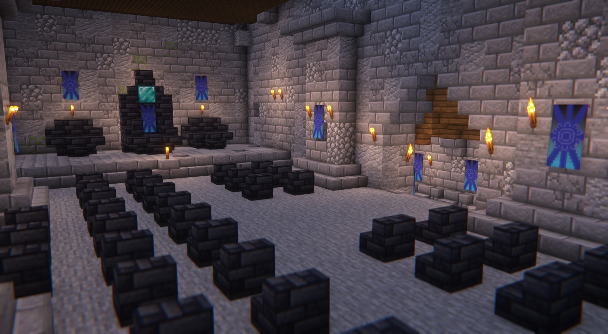
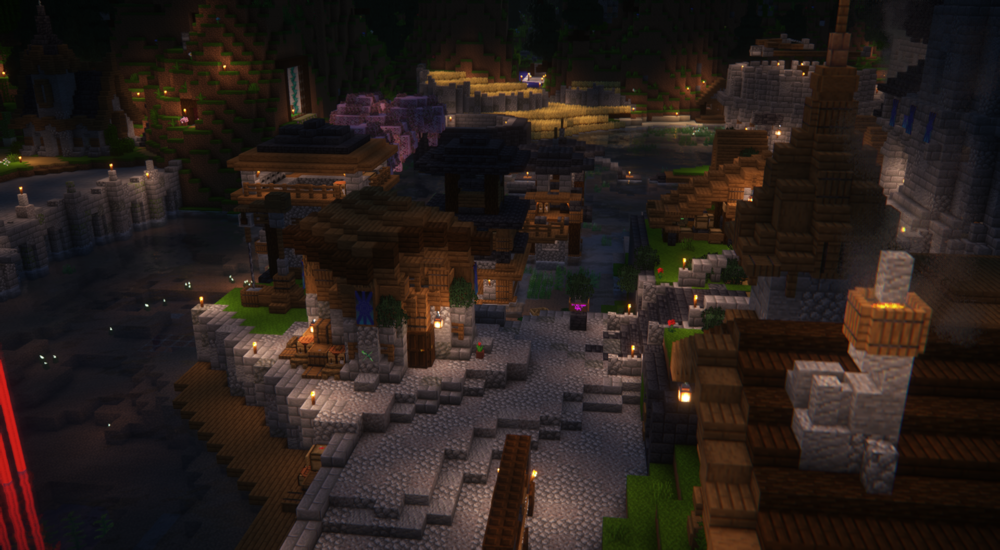
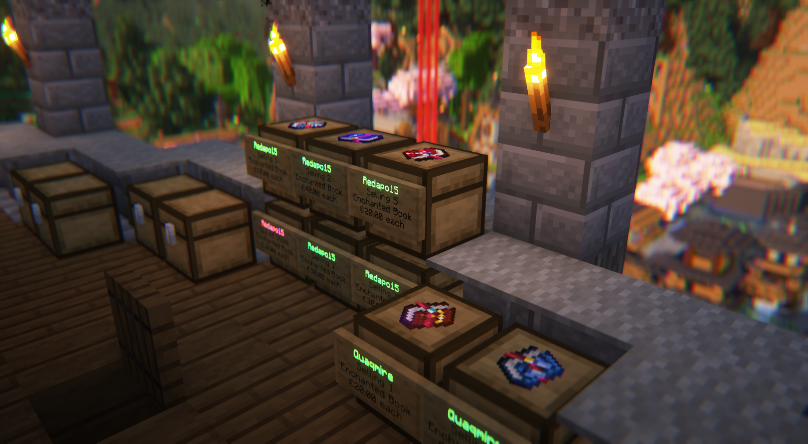
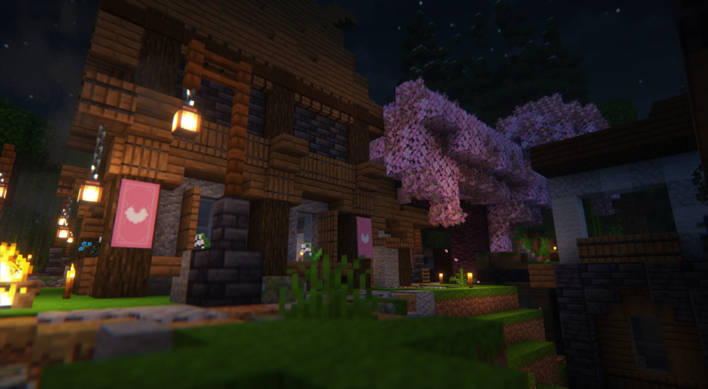
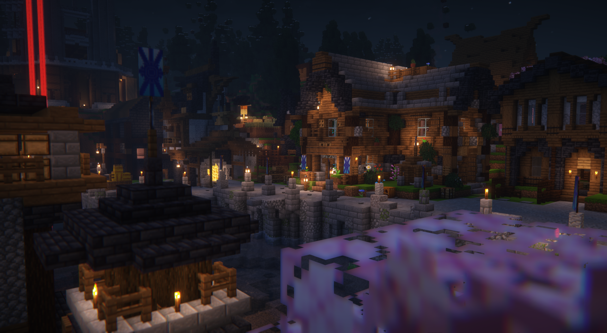
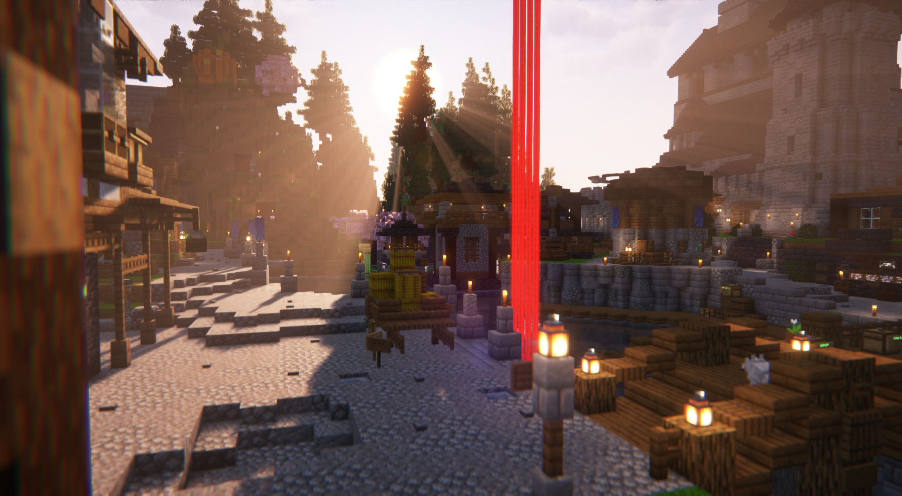

# Aquaria

<figure><figcaption>
Flag of Kala
</figcaption></figure>

<figure><figcaption>
<em>Aerial view of Aquaria</em>
</figcaption></figure>



<figure><figcaption>
Throne room
</figcaption></figure>

<figure><figcaption></figcaption></figure>

<figure><figcaption></figcaption></figure>

<figure><figcaption></figcaption></figure>







<figure><figcaption></figcaption></figure>

<figure><figcaption></figcaption></figure>

<figure><figcaption></figcaption></figure>

<figure><figcaption></figcaption></figure>

<figure><figcaption></figcaption></figure>

<figure><figcaption></figcaption></figure>


