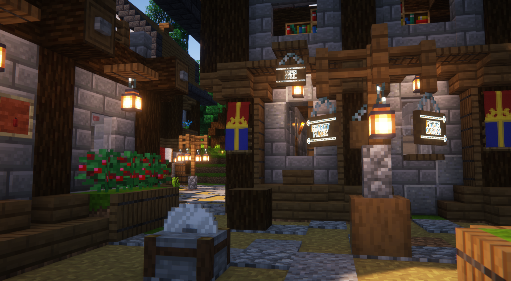
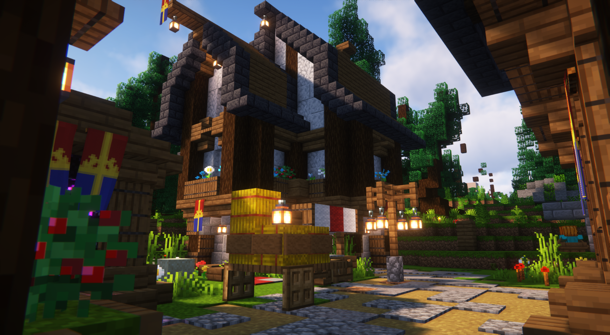
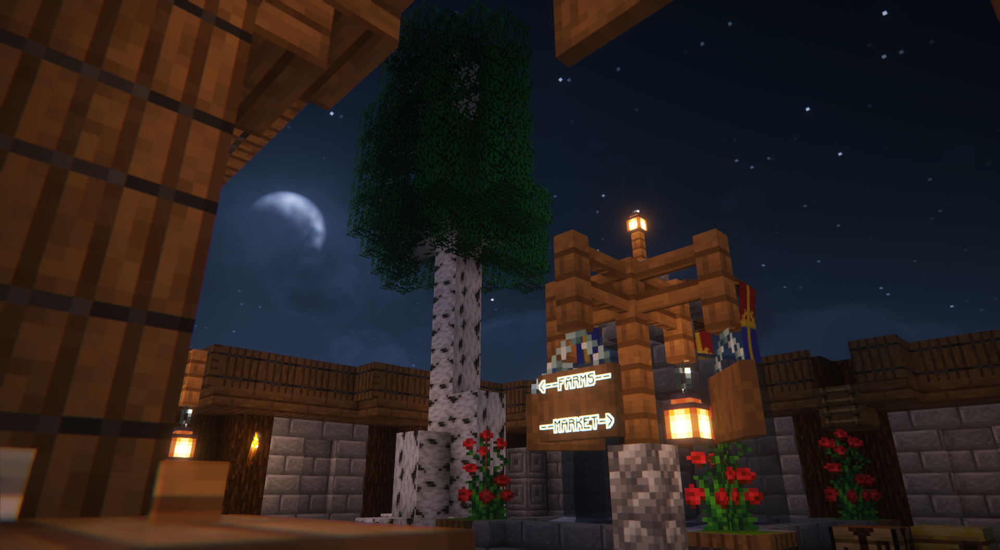
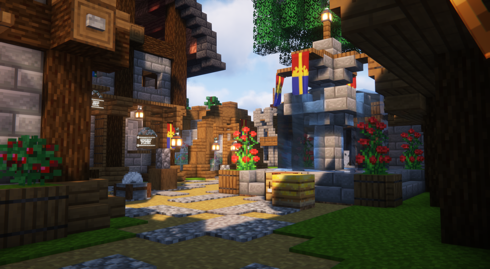

# Normannburg

<table data-view="cards"><thead><tr><th></th><th></th><th></th></tr></thead><tbody><tr><td><strong>Founder &#x26; Mayor</strong>: <a href="../players/golli1432.md">Golli1432</a></td><td></td><td><strong>Capital of Skyward Sanctum</strong></td></tr><tr><td></td><td></td><td></td></tr><tr><td><strong>Region:</strong> <a href="archived-towns/finland-region/">Finland</a> <strong>Residents</strong>: ~30</td><td><strong>Founded</strong>: <a href="../../server-dates/october-23.md#oct-14th">Oct 14 2023</a></td><td></td></tr></tbody></table>

***

## History

### [**Relocation of Normannburg**](https://github.com/SwineFeather/book/blob/main/the-world/civilization/towns/finland-region/province-of-garvia/broken-reference/README.md)

Normannburg's relocation was a significant event shaped by complicated diplomacy, and challenges arose when transporting and distributing goods and resources. Initially, Normannburg, a self-governing entity, sought to align with the nation of Constellation. However, this proposal faced resistance due to the hamlet's nearness to the neighboring nation of Kala. The fear that Kala might perceive the union as a threat led to the denial of Normannburg's initial requests for working together.

Unfazed, Golli, the leader of Normannburg, persisted in seeking alignment with Constellation. In response, Constellation proposed relocating the entire hamlet to a safer location south of Garvia. This strategic move aimed to alleviate concerns from Kala and ensure the hamlet's security.

Golli's requirement for the hamlet to be reconstructed precisely as it was. With this condition accepted, the nation's members faced the difficult challenge of moving the hamlet. This involved careful destruction, storage of items, and reconstruction of the entire hamlet at its new location.

The successful relocation and reconstruction of Normannburg would not have been possible without several individuals' dedication and work, including Volymskala, Aytte, Cosmicwaffles, SeeYouMan, Bamson, and Svardmastaren.

Images

