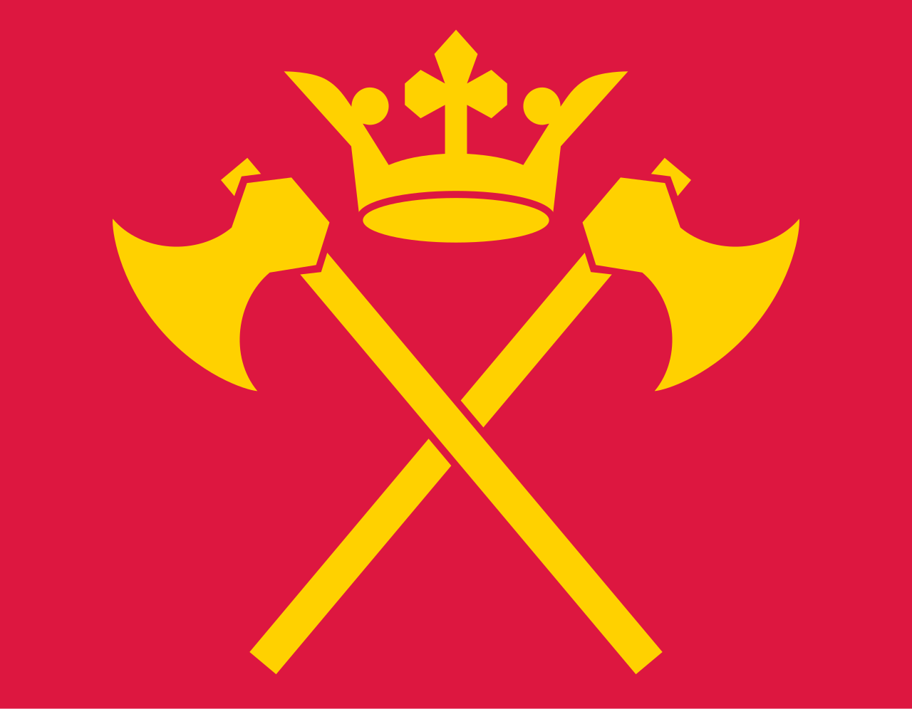

# Sogndalsfjorden

> _“Where the stone dreams and the fjord speaks.”_

***

## **Basic Information**

| Category                 | Detail                                               |
| ------------------------ | ---------------------------------------------------- |
| **Town Name**            | Sogndalsfjorden                                      |
| **Date Settled**         | 12 April 2025                                        |
| **Settled By**           | The Fjordians (Fjord People)                         |
| **Language**             | Fjorik                                               |
| **Flag**                 |        |
| **Estimated Population** | \~5 (initial settlers)                               |
| **Leaders**              | Kapakka Fjord (Chief), Arzi Fjord (Spiritual Leader) |
| **Geography**            | Forested valley in Southern Norway                   |
| **Climate**              | Cold temperate, mountainous                          |
| **Notable Lore**         | The Steindrøm, The Black Dwarf                       |

***

<strong>Background History</strong>

\

**Sogndalsfjorden** was founded on **12 April 2025** by the **Fjordians**, a nomadic people originally from the **Eurasian Steppe**. Driven from their homeland by **Mongol invasions**, they migrated westward for many years under the leadership of **Kapakka** and **Arzi Fjord**.

The Fjordians brought with them a unique culture marked by their guttural language, **Fjorik**, as well as a diet of sweet berries, and rich oral traditions. Their settlement in the Norwegian fjords marks the end of their nomadic history and the beginning of a new chapter.

According to legend, their arrival fulfills an ancient prophecy known as **"The Steindrøm"**—a vision of a rebirth in a cold land surrounded by mist and stone. Some claim seeing a mysterious **black dwarf** near the camp that is tied to this prophecy, though its origin remains unknown.

Today, **Sogndalsfjorden** stands as the spiritual and cultural foundation of the reborn Fjordian people.

<strong>The Founding Era (Tuldrenn Nahrkar)</strong><em>12 April 2025 – 22 April 2025</em>

***

\
&#xNAN;_&#x41;n artistic depiction of the Fjordians arriving in southern Norway._

***

The **Founding Era**, known in Fjorik as **Tuldrenn Nahrkar** (_“Age of Founding Stone”_), marks the first official period in the history of **Sogndalsfjorden**. It began with the initial settlement of the Fjordians in southern Norway following their long migration from the Eurasian Steppe.

This era is characterized by the transition from a **nomadic lifestyle** to a **settled society**. The Fjordians began establishing the foundations of their town, constructing early **stone houses**, **statues**, **inns**, and **underground complexes**, all while maintaining their cultural identity. During this time, **trade routes** were opened with distant lands such as **Ireland** and **Sweden**, allowing for the exchange of resources and knowledge.

Economically, the settlement saw the development of a **primitive but stable system of trade and labor**, including **resource gathering**, **crafting**, and **bartering**. Though small, the town quickly became self-sustaining and began attracting attention as a new and distinct cultural enclave.

Spiritually and culturally, the Founding Era is also a time of **revival**. **Ancient traditions**, **language**, and **beliefs** were reasserted, and the mysterious **Black Dwarf** — discovered near the heart of the valley — became a symbol of **prophecy and guidance** for many.

***

\
&#xNAN;_&#x54;he Black Dwarf: an ancient stone believed to carry prophetic significance._

***
